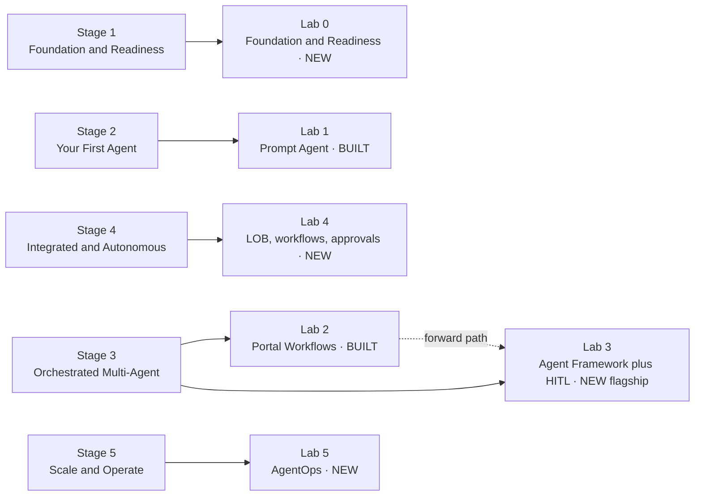
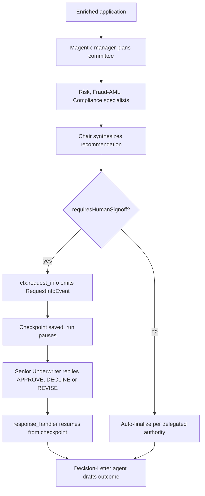

# Course Expansion Roadmap — Skilling Foundry users along the Implementation Path

This roadmap plans how to grow the **Microsoft Foundry Agent Service workshop** from its
current two labs into a full curriculum that walks a Foundry user up the **5‑stage
Implementation Path**: from *Foundation & Readiness* to *Scale & Operate (AgentOps)*.

It is a **planning document**, not lab content. When we agree on it, each new lab is authored
as Markdown in `content/`, wired into `tools/build.mjs`, and rebuilt into `modules/`.

---

## 1. Decisions locked for this expansion

| # | Decision | Choice |
|---|---|---|
| 1 | **Delivery model** for the new advanced labs | **Hybrid** — author agents in the **portal**, orchestrate them from **code**. Labs 1–2 stay portal‑first as the on‑ramp. |
| 2 | **Language / runtime** | **Python** Microsoft Agent Framework (matches concept Module 08 and the `foundry-playground` infra). |
| 3 | **Scope of this pass** | **Full 5‑stage roadmap** covering every gap. |
| 4 | **Human‑in‑the‑loop placement** | **Skip single‑agent HITL in Lab 1.** Do HITL in the **Agent Framework multi‑agent lab (Lab 3)**. |

**Why HITL moves out of Lab 1:** the portal's single‑agent chat has **no native approval
gate**. True HITL — approve/deny a tool call, pause‑then‑confirm, interrupt‑and‑resume — is a
*code* pattern. Rather than bolt a weak imitation onto Lab 1, we cover HITL properly in Lab 3
where the Agent Framework gives us `ctx.request_info()`, tool‑approval, and durable
checkpoint/resume. Stage 2's "keep a human in the loop" bullet is therefore satisfied in
Lab 3, one lab later, in code.

**Timing driver:** the portal **Workflows designer + in‑portal execution retire Dec 1, 2026**
(≈4 months out). Microsoft's stated forward path is the **Microsoft Agent Framework** running
the same declarative artifacts. So Lab 3 is not just additive — it future‑proofs the whole
multi‑agent story.

---

## 2. The Implementation Path (the target skilling model)

| Stage | Name | Outcome | The three moves |
|---|---|---|---|
| **1** | Foundation & Readiness | Set the stage for safe, high‑value agents | Prioritize high‑value use cases · Ready your data & governance · Set security & Responsible AI guardrails |
| **2** | Your First Agent | Ship one grounded agent, with a human in the loop | Ground on enterprise knowledge (RAG) · Add tools & function calling · Keep a human in the loop |
| **3** | Orchestrated Multi‑Agent | Coordinate specialists on complex work | Add a planner/orchestrator · Compose specialist agents · Add memory & an evaluation harness |
| **4** | Integrated & Autonomous | Let agents act across your systems, with oversight | Connect to line‑of‑business systems · Automate end‑to‑end workflows · Enforce guardrails & approvals |
| **5** | Scale & Operate (AgentOps) | Run reliably in production, at scale | Monitor & continuously evaluate · Optimize cost & performance · Manage lifecycle & versions |

---

## 3. Where the course is today (coverage map)

**Lab 1 — Prompt Agent with Foundry** (13 modules, portal‑first): setup, portal tour, Foundry
Toolkit (concept), build the `acl-remedy-advisor` prompt agent, tools + evaluations, MCP tools,
Foundry IQ grounding (RAG), Agent Framework (concept), hosted agents (concept), toolboxes
(concept), agent ops + Agent ID, publish to M365/Teams, custom engine agent (concept).

**Lab 2 — Multi‑agent with Agent Workflow** (4 modules, portal‑first): the Meridian loan
underwriting scenario — 8 prompt agents composed in the **portal Workflows designer**
(sequential + group chat + HITL), then run & trace in Application Insights.

Coverage against the path (Covered / Partial / **Gap**):

| Stage · move | Status | Where |
|---|---|---|
| 1 · Prioritize high‑value use cases | **Gap** | — |
| 1 · Ready data & governance | Partial | Lab 1 · 07 (Foundry IQ data) — governance/RBAC/network not taught |
| 1 · Security & Responsible AI guardrails | **Gap** | — (no content‑filter / RAI / red‑team lab) |
| 2 · Ground on enterprise knowledge (RAG) | Covered | Lab 1 · 07 Foundry IQ |
| 2 · Add tools & function calling | Covered | Lab 1 · 05 tools, · 06 MCP |
| 2 · Keep a human in the loop | **Gap** (by design → Lab 3) | relocated to Lab 3 |
| 3 · Add a planner/orchestrator | Partial | Lab 2 group‑chat Chair ≈ moderator, not a true planner |
| 3 · Compose specialist agents | Covered | Lab 2 (8 agents) |
| 3 · Add memory & an evaluation harness | Partial | Lab 2 uses workflow variables; evals only single‑agent (Lab 1 · 05) |
| 4 · Connect to line‑of‑business systems | Partial | Lab 1 · 06 MCP is the mechanism; no real LOB end‑to‑end |
| 4 · Automate end‑to‑end workflows | Partial | Lab 2 — but portal‑only and retiring Dec 2026 |
| 4 · Enforce guardrails & approvals | Partial | Lab 2 HITL gate = approval; no policy/guardrail enforcement |
| 5 · Monitor & continuously evaluate | Partial | Lab 1 · 11 Agent Ops + App Insights tracing; no continuous eval |
| 5 · Optimize cost & performance | **Gap** | — |
| 5 · Manage lifecycle & versions | Partial | Lab 1 · 11 Agent ID; no versioning / CI‑CD |

**Read:** Stage 2 is essentially done (minus HITL, moved to Lab 3). Stage 3 is half‑built in the
portal. Stages 1, 4, 5 are the real gaps.

---

## 4. Target curriculum (labs mapped to the path)

| Lab | Stage | Title | Status | Delivery | Scenario |
|---|---|---|---|---|---|
| **0** | 1 | Foundation & Readiness | **NEW** | Portal + governance controls | (cross‑cutting) |
| **1** | 2 | Your First Agent (Prompt Agent) | Built · light edits | Portal‑first | `acl-remedy-advisor` |
| **2** | 3 | Orchestrated Multi‑Agent — Portal Workflows | Built · keep as visual intro | Portal‑first | Meridian loan |
| **3** | 3 | Orchestrated Multi‑Agent — Agent Framework + HITL | **NEW (flagship)** | Hybrid (portal agents, Python code) | Meridian loan (re‑implemented) |
| **4** | 4 | Integrated & Autonomous | **NEW** | Hybrid, code‑led | Meridian loan → live systems |
| **5** | 5 | Scale & Operate (AgentOps) | **NEW** (absorbs Lab 1 · 11) | Hybrid + azd/CI | both scenarios |

**Scenario continuity is deliberate.** Learners see the *same* Meridian loan case go from the
**portal designer (Lab 2)** to **code (Lab 3)** to **production (Labs 4–5)** — the exact
"designer → Agent Framework" migration Microsoft is steering everyone toward.

---

## 5. Detailed lab specs

### Lab 0 — Foundation & Readiness  *(Stage 1, NEW)*

**Goal:** before anyone builds an agent, make the environment *safe and ready*. Turns today's
implicit "Module 01 setup" into an explicit readiness gate.

| Module | Type | Covers (Stage‑1 move) | Hands‑on |
|---|---|---|---|
| 0.1 Prioritize the use case | Concept + worksheet | Prioritize high‑value use cases | A value/feasibility scoring worksheet; pick the workshop scenario deliberately |
| 0.2 Ready your data & knowledge | Hands‑on | Ready your data & governance | Create the Foundry IQ knowledge source; data classification & retention notes; connection hygiene |
| 0.3 Identity & RBAC (networking concept) | Hands‑on (RBAC) + concept (networking) | Ready your data & governance | Hands‑on: project roles (Reader/Contributor), managed identity. Concept + links only: private endpoint / network posture (no hands‑on) |
| 0.4 Content filters & Responsible AI | Hands‑on | Security & Responsible AI guardrails | Configure content filters on the model deployment; RAI notes; prompt‑shield / jailbreak awareness |
| 0.5 Guardrails baseline & red‑team primer | Concept | Security & Responsible AI guardrails | A checklist you carry into every later lab; simple red‑team prompts to try |

**After Lab 0 a learner can:** justify *why* this agent, point their data at Foundry IQ safely,
set RBAC + content filters, and articulate the guardrail baseline.

---

### Lab 1 — Your First Agent  *(Stage 2, BUILT — light edits only)*

Already strong: RAG grounding (Foundry IQ), tools + function calling (tools, MCP), evaluation,
publish. **No new HITL here** (moved to Lab 3, see §1).

**Light edits:**
- Add a one‑paragraph pointer at the end of Module 07/05: *"You now have a grounded, tooled
  single agent. Human‑in‑the‑loop and orchestration come in Lab 3, in code."*
- Cross‑link Module 08 (Agent Framework concept) forward to Lab 3 as its hands‑on payoff.

---

### Lab 2 — Orchestrated Multi‑Agent, Portal Workflows  *(Stage 3, BUILT — keep until ~Oct 2026)*

Keep as the **visual, declarative introduction** to the three orchestration patterns. It is the
fastest way to *see* sequential + group chat + HITL without code. **Plan:** keep alongside Lab 3
until ~Oct 2026, then **demote to an appendix** as the Dec 1 2026 designer retirement lands.

**Edits:**
- Strengthen the existing retirement banner and add a "**Continue in code → Lab 3**" call‑to‑action
  at the end of Module 04, framing Lab 3 as the forward path (not a throwaway).

---

### Lab 3 — Orchestrated Multi‑Agent with Agent Framework + HITL  *(Stage 3, NEW — flagship)*

**The centrepiece of this expansion.** Re‑implement the Meridian loan workflow in **Python** with
the Microsoft Agent Framework, reusing the **portal‑authored** committee agents from Lab 2
(the hybrid model). This is where **planner/orchestration**, **memory**, an **eval harness**, and
**human‑in‑the‑loop** all land.

**Prerequisites:** Lab 2 agents exist in the project · Python 3.10+ · `agent-framework` +
`azure-identity` · `az login` (uses `DefaultAzureCredential`/`AzureCliCredential`) · App Insights
connected (already provisioned as `appi-foundry-playground`).

| Module | Covers | Hands‑on (Agent Framework primitive) |
|---|---|---|
| 3.1 From designer to code | orientation | Map each Lab 2 node to an AF concept; project setup, auth, first `agent.run()` |
| 3.2 Bind portal agents from code | hybrid delivery | Connect to the 8 Lab‑2 agents with **`FoundryAgent(agent_name=…, allow_preview=True)`** (or `AzureAIAgentClient(agent_name=…)`) |
| 3.3 Sequential intake pipeline | Compose specialists | **`SequentialBuilder`** — intake → enrichment, passing structured output forward |
| 3.4 The credit committee | Add a planner/orchestrator · Compose specialists | **Magentic orchestration** (a manager agent *plans* and coordinates Risk / Fraud‑AML / Compliance) — the true "planner/orchestrator". Contrast with **Group Chat** for simpler moderation |
| 3.5 Human‑in‑the‑loop sign‑off | Keep a human in the loop · Enforce approvals | Senior‑Underwriter gate via **`ctx.request_info()` + `@response_handler`** (emits `RequestInfoEvent`); and **tool approval** with **`@tool(approval_mode="always_require")`** |
| 3.6 Durable pause & resume | Keep a human in the loop | **Checkpointing** (`FileCheckpointStorage`, `WorkflowBuilder(checkpoint_storage=…)`): pause the run, persist, resume later; pending requests re‑emit on resume |
| 3.7 Memory & state | Add memory | `AgentThread` / agent sessions + shared workflow state carrying the underwriting fact sheet between stages |
| 3.8 Evaluation harness | Add an evaluation harness | Run the Foundry evaluators over a small dataset **in code**; assert quality gates; traces flow to App Insights |
| 3.9 Trace it | (bridges to Stage 5) | OpenTelemetry via `configure_azure_monitor()` → view spans in Foundry Observability / App Insights |

**HITL flow (Meridian sign‑off), in code:**

**After Lab 3 a learner can:** orchestrate specialist agents with a planning manager, gate
material actions behind a human, survive a pause/restart with checkpoints, and prove quality
with a coded eval harness — all traced.

> **Security note for authoring:** checkpoint storage is a **trust boundary**. The lab must
> store checkpoints in trusted, access‑controlled storage and never resume from untrusted
> checkpoint data.

---

### Lab 4 — Integrated & Autonomous  *(Stage 4, NEW)*

**Goal:** let the orchestration *act* on real systems, safely.

| Module | Covers (Stage‑4 move) | Hands‑on |
|---|---|---|
| 4.1 Connect a line‑of‑business system | Connect to LOB systems | Wrap the **in‑repo FastAPI "core‑banking" stub** (deployed via the existing `azd` infra) as a function tool / **MCP** tool; consume a **Foundry Toolbox** via `MCPStreamableHTTPTool` |
| 4.2 End‑to‑end automation | Automate end‑to‑end workflows | Extend Lab 3: on APPROVE, the workflow *books* the action through the LOB tool and emails the decision letter |
| 4.3 Guardrails & approval gates | Enforce guardrails & approvals | Policy checks before side‑effecting tools; `approval_mode="always_require"` on money‑movement tools; content filters + RAI checks inline |
| 4.4 Autonomy with oversight | Automate + oversight | Introduce the **Harness** (planning, todo tracking, context compaction, don't‑ask‑again approvals) for longer multi‑step runs; bounded autonomy |
| 4.5 Deploy as a hosted agent | (bridges to Stage 5) | `Workflow.as_agent()` → **`azd ai agent init` / `azd provision` / `azd deploy`** to Foundry Agent Service; env vars injected automatically |

**After Lab 4 a learner can:** connect agents to real systems, complete an action end‑to‑end,
enforce approvals/guardrails on side effects, and deploy the orchestration as a hosted agent.

---

### Lab 5 — Scale & Operate (AgentOps)  *(Stage 5, NEW — absorbs Lab 1 · 11)*

**Goal:** run it reliably in production. Folds today's "Agent Ops & Agent ID" module into a full
operations lab.

| Module | Covers (Stage‑5 move) | Hands‑on |
|---|---|---|
| 5.1 Monitoring & tracing | Monitor | App Insights dashboards, span exploration, alerting on failures/latency; Agent ID correlation |
| 5.2 Continuous evaluation | Continuously evaluate | Scheduled/CI evaluation runs over golden datasets; regression gates; online eval on sampled prod traffic |
| 5.3 Cost & performance | Optimize cost & performance | Token/cost telemetry, model routing (cheaper model for easy paths), caching, concurrency tuning |
| 5.4 Lifecycle & versioning | Manage lifecycle & versions | Agent versioning (`VersionRefIndicator`), promote dev→prod, rollback; **azd**‑based CI/CD for the hosted agent |
| 5.5 Governance at scale | (cross‑cuts Stage 1) | Audit trails, data‑retention, Responsible AI reporting; ties back to Lab 0 guardrails |

**After Lab 5 a learner can:** monitor and continuously evaluate agents, control cost, and manage
versions/rollouts through CI — closing the loop back to Foundation.

---

## 6. Agent Framework primitive cheat‑sheet (verified against Microsoft Learn)

For whoever authors Labs 3–5. Confirm exact signatures against the linked docs at authoring time
(the SDK is evolving).

| Need | Primitive (Python) |
|---|---|
| Use a **portal/hosted agent by name** | `FoundryAgent(agent_name=…, credential=…, allow_preview=True)` |
| App owns instructions/tools over a model | `Agent(client=FoundryChatClient(project_endpoint=…, model=…, credential=…), …)` |
| Existing agent by id/name (Azure AI path) | `AzureAIAgentClient(agent_id=… / agent_name=…, project_endpoint=…, credential=…)` |
| **Planner/orchestrator** | **Magentic** orchestration (manager plans + coordinates specialists) |
| Simpler moderated multi‑agent | Group Chat orchestration |
| Ordered pipeline | `SequentialBuilder(participants=[…]).build()` |
| Parallel fan‑out | Concurrent orchestration |
| Dynamic control transfer | Handoff orchestration |
| **HITL — pause for input** | `ctx.request_info()` + `@response_handler` → `RequestInfoEvent` |
| **HITL — approve a tool call** | `@tool(approval_mode="always_require")` |
| **HITL — pause after an agent** | `SequentialBuilder(...).with_request_info()` |
| **Durable pause/resume** | `FileCheckpointStorage` + `WorkflowBuilder(checkpoint_storage=…)`; resume via `workflow.run(checkpoint_id=…, responses=…)` |
| Memory / state | `AgentThread` / agent sessions; shared workflow state |
| Long autonomous tasks | **Harness** (planning, todo, context compaction, memory, approvals) |
| Observability | `azure-monitor-opentelemetry` → `configure_azure_monitor()`; or `FoundryChatClient.configure_azure_monitor()` |
| Deploy to Foundry | `Workflow.as_agent()` + `azd ai agent init` / `azd provision` / `azd deploy` |

---

## 7. Build sequence & priorities

| Priority | Lab | Rationale |
|---|---|---|
| **P1** | **Lab 3 — Agent Framework + HITL** | Your explicit ask; satisfies Stage 2 HITL + Stage 3 planner/memory/eval; future‑proofs against the Dec 1 2026 designer retirement. |
| **P2** | **Lab 5 — AgentOps** | Extends the existing Module 11; highest production value; needed to operate anything from Lab 3/4. |
| **P3** | **Lab 0 — Foundation & Readiness** | Cheap to author (mostly portal + worksheets); makes the whole path "safe by default". |
| **P4** | **Lab 4 — Integrated & Autonomous** | Highest effort (needs a mock LOB system + hosted deploy); best done after Lab 3 and Lab 5 exist. |

---

## 8. Authoring mechanics (how new labs slot into this repo)

- **Content is the source of truth.** Author each module as `content/<slug>.md`. Use slug
  prefixes per lab, e.g. `lab0-01-…`, `lab3-01-…`. The generator strips the `# heading`,
  converts `> [!NOTE]` callouts, turns `- [ ]` items into progress steps, and builds the TOC.
- **Register metadata** in the `MODULES` array in `tools/build.mjs` (num, slug, title, type,
  minutes, difficulty, `lab`), and add each new lab to **`WORKSHOP_LABS`** (title, navTitle,
  blurb). Then `cd tools && npm run build` regenerates `modules/*.html` and
  `assets/js/modules-data.js`.
- **Lab numbering:** Lab 0 can use `lab: 0` so it sorts before Lab 1; verify the landing‑page
  grouping renders 0 first (adjust ordering in `app.js`/`modules-data` if needed).
- **Code labs need a code home.** Add a top‑level folder per code lab (mirroring
  `foundry-workflow/`), e.g. `foundry-agent-framework/` containing the Python project, a
  `requirements.txt`/`pyproject.toml`, `README.md`, a **`.devcontainer/`** (one‑command setup for
  Lab 3+), and paste‑ready snippets the module links to.
- **Screenshots** go in `assets/img/screenshots/lab-XX/`; keep the "Add your own screenshot"
  placeholders for newly authored portal steps.
- **Scenario reuse:** Lab 3 reuses the 8 Lab‑2 agent definitions in `foundry-workflow/agents.md`
  and the samples in `sample-applications.md` — no new agent prompts needed, only code.

---

## 9. Resolved decisions

All five open decisions were confirmed on **2026-07-31** (recommendations accepted).

| # | Decision | Resolution |
|---|---|---|
| 1 | Lab 2 vs Lab 3 long‑term | **Keep both until ~Oct 2026, then demote Lab 2** (portal Workflows) to an appendix; Lab 3 becomes the canonical Stage‑3 lab as the Dec 1 2026 designer retirement lands. |
| 2 | .NET reference track | **Python‑only.** No C# track for now (revisit if there's demand). |
| 3 | Runtime for code labs | **Ship a `.devcontainer` (+ `azd` template) for Lab 3+** so setup is one command. |
| 4 | Mock LOB system for Lab 4 | **Build a tiny in‑repo FastAPI "core‑banking" stub**, deployable via the existing `azd` infra. |
| 5 | Foundation lab depth | **Content filters + RBAC hands‑on; networking as concept + links** (no private‑endpoint hands‑on). |

---

## 10. Sources (Microsoft Learn — verified while planning)

- Workflow orchestrations (Sequential / Concurrent / Group Chat / Handoff / **Magentic**):
  https://learn.microsoft.com/agent-framework/workflows/orchestrations/
- Magentic (planner/orchestrator):
  https://learn.microsoft.com/agent-framework/workflows/orchestrations/magentic
- Human‑in‑the‑loop (request/response, `ctx.request_info`, `@response_handler`):
  https://learn.microsoft.com/agent-framework/workflows/human-in-the-loop
- Sequential HITL (tool approval, `.with_request_info()`):
  https://learn.microsoft.com/agent-framework/workflows/orchestrations/sequential#sequential-orchestration-with-human-in-the-loop
- Checkpoints (durable pause/resume; trust‑boundary note):
  https://learn.microsoft.com/agent-framework/workflows/checkpoints
- Microsoft Foundry provider (`FoundryAgent`, `FoundryChatClient`):
  https://learn.microsoft.com/agent-framework/agents/providers/microsoft-foundry
- `AzureAIAgentClient`:
  https://learn.microsoft.com/python/api/agent-framework-core/agent_framework.azure.azureaiagentclient
- Observability (OpenTelemetry → App Insights):
  https://learn.microsoft.com/agent-framework/agents/observability
- Foundry hosted agents (`Workflow.as_agent()`, `azd` deploy):
  https://learn.microsoft.com/agent-framework/hosting/foundry-hosted-agent
- AutoGen → Agent Framework migration (Magentic + checkpointing + request/response):
  https://learn.microsoft.com/agent-framework/migration-guide/from-autogen/

---

## 11. Changelog

| Date | Change |
|---|---|
| 2026-07-31 | Initial roadmap. Locked hybrid/Python delivery; HITL moved from Lab 1 to Lab 3; proposed Labs 0, 3, 4, 5 to complete the 5‑stage path. |
| 2026-07-31 | Resolved all five open decisions (§9): keep‑both‑then‑demote Lab 2 (~Oct 2026); Python‑only; `.devcontainer` for Lab 3+; in‑repo FastAPI LOB stub via `azd`; Foundation networking as concept + links. Propagated to Labs 0, 2, 4 and §8. |
| 2026-07-31 | **Scaffolded Lab 3 (P1).** Authored 9 modules (`content/lab3-*.md`) + the `foundry-agent-framework/` Python project (`.devcontainer`, `src/` with Magentic committee, request/response HITL, checkpointing, eval harness, tracing); wired into `tools/build.mjs` (`MODULES`, `LABS`, `lab>=2` self‑authored). Build green (26/26); Python `py_compile` clean. Code is a **preview‑tracking scaffold** (`# VERIFY` markers). |
