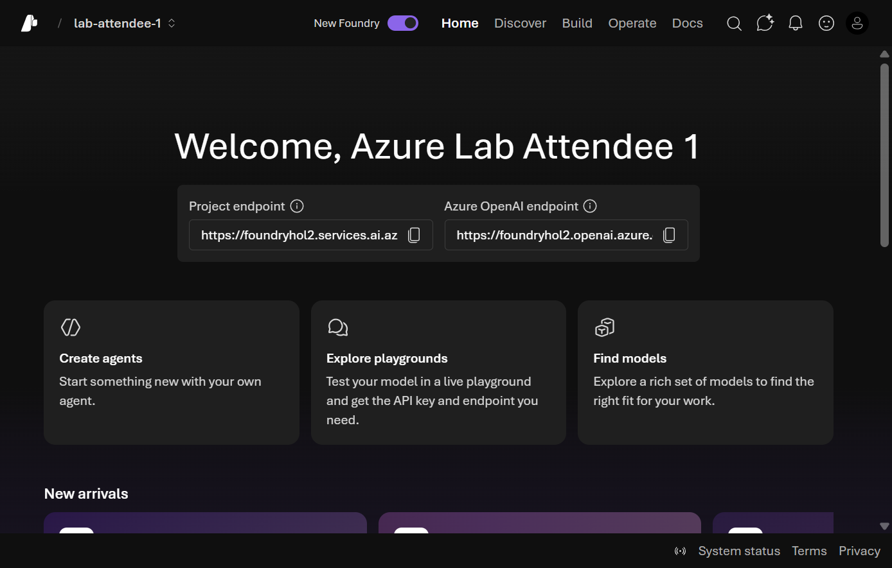

This module gets you into the **Microsoft Foundry portal** and ready to build. Because you are using **your own Azure subscription** with Foundry access already in place, there is nothing to install — everything here happens in the browser at [ai.azure.com](https://ai.azure.com).

> [!TIP]
> Tick the checkbox next to each step as you complete it. Your progress is saved in this browser and shown on the [workshop overview](../index.html).

## Objectives

- Sign in to the Microsoft Foundry portal and enable the **New Foundry** experience.
- Select an existing Foundry project, or create a new one in your subscription.
- Deploy a chat model (and an embedding model) that the rest of the workshop uses.
- Confirm you can reach the **Build** and **Operate** areas of your project.

## Prerequisites

You only need a modern browser and an Azure account that can sign in to Foundry. To **create** a project or **deploy** models you need adequate permissions on the target subscription or resource group:

| You want to… | Typical role needed |
|---|---|
| Open the portal and browse | Any access to the subscription |
| Create a Foundry project / resource | **Owner** or **Contributor** on the resource group |
| Deploy models | **Azure AI Account Owner** / **Cognitive Services Contributor** (or Owner/Contributor) |

> [!NOTE]
> If your organization has already provisioned a Foundry project and deployed models for you, you can skip project creation and model deployment — just confirm you can see the project and its models, then continue to [Module 02](02-foundry-portal-walkthrough.html).

## Steps

### Part 1 — Sign in and enable New Foundry

- [ ] Open the [Foundry portal](https://ai.azure.com) and sign in with your Azure account.

- [ ] Enable the **New Foundry** toggle in the top navigation bar if it is not already on. Every module in this workshop uses the New Foundry experience.

  

  
📸 Screenshot: New Foundry toggle in the top navigation bar

  

  

### Part 2 — Select or create a project

A **project** is the workspace that holds your agents, model deployments, tools, knowledge, and evaluations.

- [ ] If you already have a project, select it from the project dropdown and choose **Let's go**. You should land on the New Foundry project home page.

  

  
📸 Screenshot: New Foundry project home page

  

  

- [ ] If you do **not** have a project yet, create one:
  - Select **＋ Create** (or **New project**) from the project picker.
  - Give it a name such as `acl-remedy-workshop`.
  - Choose (or let the portal create) the underlying **Foundry resource**, subscription, and resource group.
  - Select **Create** and wait for provisioning to finish, then open the project.

  

  <svg viewBox="0 0 24 24" fill="none" stroke="currentColor" stroke-width="1.8" stroke-linecap="round" stroke-linejoin="round"><path d="M14.5 4h-5L7 7H4a2 2 0 0 0-2 2v9a2 2 0 0 0 2 2h16a2 2 0 0 0 2-2V9a2 2 0 0 0-2-2h-3l-2.5-3Z"/><circle cx="12" cy="13" r="3.5"/></svg>
  <strong>Add your own screenshot:</strong> the <em>Create project</em> dialog in your subscription.
  

### Part 3 — Deploy the models you'll use

The workshop scenario needs a **chat model**. A later module ([Foundry IQ](07-foundry-iq.html)) also uses an **embedding model**, so deploy both now while you are here.

- [ ] In the left navigation, open **Build → Models** (or **Discover → Models**) and select **＋ Deploy model**.

- [ ] Deploy a chat model — for example **`gpt-4o`** or **`gpt-4.1`**:
  - Search for the model, select it, and choose **Confirm / Deploy**.
  - Accept the default deployment name (matching the model name keeps later steps simple).
  - Leave the default deployment type unless your organization requires a specific one.

  

  <svg viewBox="0 0 24 24" fill="none" stroke="currentColor" stroke-width="1.8" stroke-linecap="round" stroke-linejoin="round"><path d="M14.5 4h-5L7 7H4a2 2 0 0 0-2 2v9a2 2 0 0 0 2 2h16a2 2 0 0 0 2-2V9a2 2 0 0 0-2-2h-3l-2.5-3Z"/><circle cx="12" cy="13" r="3.5"/></svg>
  <strong>Add your own screenshot:</strong> the <em>Deploy model</em> dialog showing your chat model.
  

- [ ] Deploy an embedding model — for example **`text-embedding-3-large`** — using the same **Deploy model** flow. You will use it to ground the agent in Module 07.

- [ ] Confirm both deployments appear under **Build → Models** with a status of **Succeeded**.

> [!IMPORTANT]
> Model availability and quota vary by region. If a model is greyed out or a deployment fails on quota, pick a supported region for your Foundry resource or request a quota increase for that model family in the Azure portal.

## Validation

- The **New Foundry** toggle is on and you can open your project's home page.
- Your project is selectable from the project dropdown.
- **Build → Models** lists a deployed **chat** model and an **embedding** model, both **Succeeded**.
- You can open the **Build** and **Operate** areas without permission errors.

## Congratulations 🎉

Your Foundry project is ready. You signed in, enabled New Foundry, confirmed (or created) a project in your own subscription, and deployed the chat and embedding models the rest of the workshop relies on. Everything is in place to start building the `acl-remedy-advisor` agent.

> [!TIP]
> **Next up → [Module 02: Foundry portal walkthrough](02-foundry-portal-walkthrough.html)**
> Get oriented across the Home, Discover, Build, and Operate tabs so you know exactly where every model, tool, and setting lives.

## Troubleshooting

| Symptom | Likely cause | Fix |
|---------|--------------|-----|
| No **Create project** option | You lack write access on the subscription/resource group. | Ask an Owner/Contributor to create the project, or grant yourself the role. |
| **Deploy model** button disabled | Missing model-deployment permissions. | Get **Azure AI Account Owner** / **Cognitive Services Contributor** (or Owner) on the Foundry resource. |
| Deployment fails on quota | No capacity for that model in the region. | Choose a different region for the Foundry resource, or request a quota increase in the Azure portal. |
| Can't see the endpoint or New Foundry layout | Classic view is active. | Turn the **New Foundry** toggle on in the top navigation bar. |
| Project home won't load | Transient portal issue or role propagation delay. | Refresh, wait a minute for role assignments to apply, and try again. |
