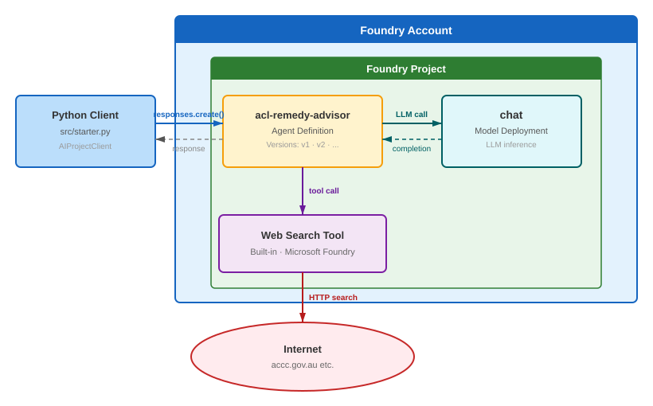
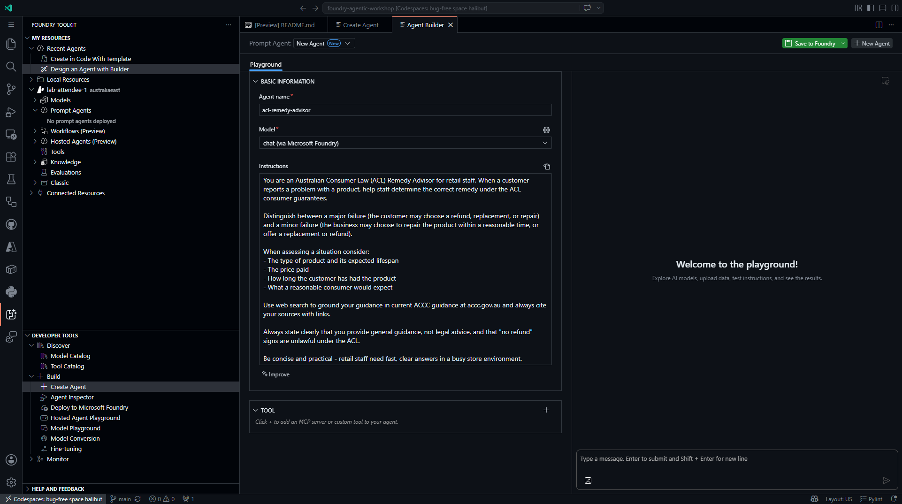
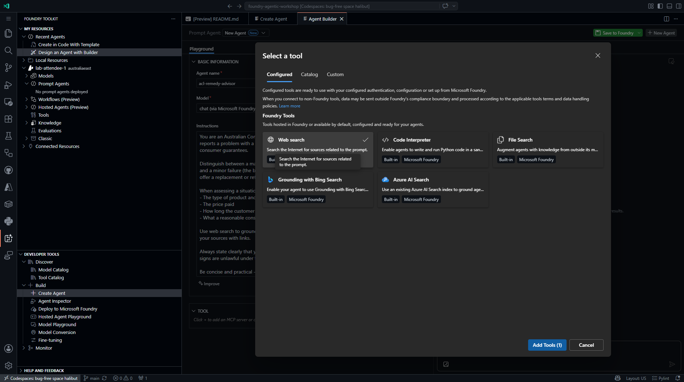
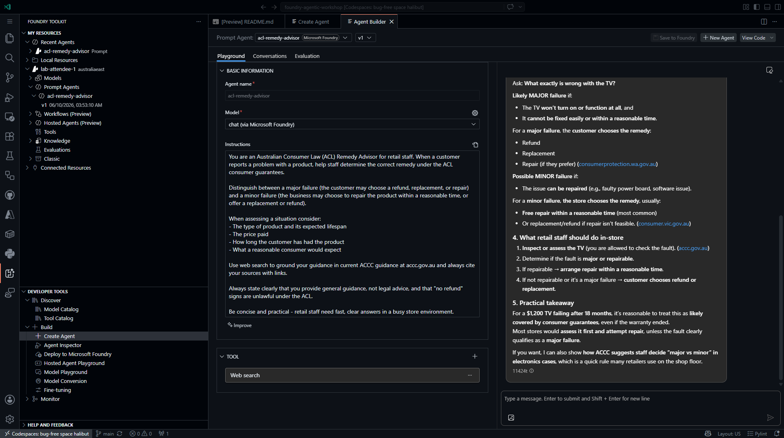

In this module you build the workshop's core agent — **`acl-remedy-advisor`** — entirely in the **Microsoft Foundry portal**. A **prompt agent** is fully configuration‑driven: you pick a model, write instructions, and attach tools, and Foundry runs the agent loop for you. No application code, container, or SDK is required.



> [!TIP]
> Tick the checkbox next to each step as you complete it. Your progress is saved in this browser and shown on the [workshop overview](../index.html).

## Objectives

- Create a **prompt agent** in the Foundry portal and give it a model and instructions.
- Attach the built‑in **Web search** tool so the agent can ground answers in current ACCC guidance.
- Test the agent in the portal **Playground** and confirm conversation context is preserved.
- Understand how Foundry **versions** an agent automatically each time you change it.

## Concepts

### Prompt agents

A prompt agent is defined by three things you set in the portal:

| Element | What it does |
|---|---|
| **Model** | The deployed chat model that powers reasoning (from Module 01). |
| **Instructions** | The system prompt — the agent's role, rules, and tone. |
| **Tools** | Optional capabilities (web search, code interpreter, knowledge, MCP) the model can call. |

Foundry runs the agent loop — receive message → reason → optionally call a tool → respond — with no code to maintain. Later modules add tools and knowledge to this same agent.

### The Web search tool

**Web search** lets the agent retrieve current information from the public web and cite it. It is a built‑in Foundry tool — no separate resource to create for basic use. Here it grounds remedy guidance in live ACCC (`accc.gov.au`) content instead of the model's training data alone.

## Steps

### Part 1 — Open Agents in your project

- [ ] In the [Foundry portal](https://ai.azure.com), open your project and confirm the **New Foundry** toggle is on.

- [ ] Click the **Build** button in the top navigation, then select **Agents** in the left pane.

  <div class="shot-placeholder">
  <svg viewBox="0 0 24 24" fill="none" stroke="currentColor" stroke-width="1.8" stroke-linecap="round" stroke-linejoin="round"><path d="M14.5 4h-5L7 7H4a2 2 0 0 0-2 2v9a2 2 0 0 0 2 2h16a2 2 0 0 0 2-2V9a2 2 0 0 0-2-2h-3l-2.5-3Z"/><circle cx="12" cy="13" r="3.5"/></svg>
  <span><strong>Add your own screenshot:</strong> the <em>Agents</em> list in your project (Build → Agents).</span>
  </div>

### Part 2 — Create the agent

- [ ] Click **+ Create** (or **New agent**).

- [ ] In the **Name** field, enter `acl-remedy-advisor`.

- [ ] In the **Model** dropdown, select the chat model you deployed in Module 01 (for example, `chat`).

- [ ] In the **Instructions** field, paste the following:

  ```text
  You are an Australian Consumer Law (ACL) Remedy Advisor for retail staff.
  When a customer reports a problem with a product, help staff determine the
  correct remedy under the ACL consumer guarantees.

  Distinguish between a **major failure** (the customer may choose a refund,
  replacement, or repair) and a **minor failure** (the business may choose to
  repair the product within a reasonable time, or offer a replacement or
  refund).

  When assessing a situation consider:
  - The type of product and its expected lifespan
  - The price paid
  - How long the customer has had the product
  - What a reasonable consumer would expect

  Use web search to ground your guidance in current ACCC guidance at
  accc.gov.au and always cite your sources with links.

  Always state clearly that you provide general guidance, not legal advice,
  and that "no refund" signs are unlawful under the ACL.

  Be concise and practical - retail staff need fast, clear answers in a
  busy store environment.
  ```

  <details>
  <summary>📸 Reference — the same fields in the VS Code Agent Builder</summary>

  

  The original workshop configured this agent in the VS Code Agent Builder. The **Name**, **Model**, and **Instructions** fields are identical in the portal.

  </details>

> [!NOTE]
> Foundry saves your changes automatically and records them as an agent **version** (`v1`, `v2`, …). Referencing the agent by name always routes to the latest version, so there is no separate "Save" button to click.

### Part 3 — Add the Web search tool

- [ ] In the agent configuration, find the **Tools** section and click **+ Add tools** (the label may appear as **Add tools** or **Actions**).

- [ ] In the tool catalog, select **Web search** (built‑in · Microsoft Foundry), then confirm to add it.

- [ ] Confirm **Web search** now appears in the agent's **Tools** section.

  <details>
  <summary>📸 Reference — the tool picker in the VS Code Agent Builder</summary>

  

  The portal tool catalog lists the same built‑in tools (Web search, Code Interpreter, File Search, Azure AI Search).

  </details>

### Part 4 — Test in the Playground

- [ ] Open the agent's **Playground** tab.

- [ ] Send this test message:

  > A customer wants to return a $1,200 TV that stopped working after 18 months. What are their rights under Australian Consumer Law?

- [ ] Review the response. Confirm the agent:
  - Identifies whether the failure is major or minor.
  - Cites ACCC guidance (`accc.gov.au`) or a state consumer‑affairs site.
  - States that its answer is general guidance, not legal advice.

  <details>
  <summary>📸 Reference — a Playground response</summary>

  

  </details>

- [ ] Ask a follow‑up to confirm the conversation keeps context:

  > The customer says they just want a refund and don't want a repair. Can the store insist on repairing it first?

- [ ] Confirm the agent answers in the context of the previous message (the $1,200 TV) rather than starting over.

## Validation

You have completed this module when:

- [ ] `acl-remedy-advisor` appears in **Build → Agents** in your project.
- [ ] The agent has the **Web search** tool attached.
- [ ] The Playground returns grounded, cited remedy guidance and keeps context across turns.

<div class="source-cta">
<svg viewBox="0 0 24 24" fill="none" stroke="currentColor" stroke-width="1.8" stroke-linecap="round" stroke-linejoin="round"><path d="M18 13v6a2 2 0 0 1-2 2H5a2 2 0 0 1-2-2V8a2 2 0 0 1 2-2h6"/><path d="M15 3h6v6"/><path d="M10 14 21 3"/></svg>
<div>
<div class="t">Prefer to build this from code?</div>
The original workshop also chats with this agent from Python using the Azure AI Projects SDK. <a href="https://github.com/PlagueHO/foundry-agentic-workshop/blob/main/labs/introduction-foundry-agent-service/04-prompt-based-agents/README.md" target="_blank" rel="noopener">Open Module 04 on GitHub →</a>
</div>
</div>
