In this module you extend `acl-remedy-advisor` with a second tool — **Code Interpreter** — refine its instructions so it routes work to the right tool, then run a no‑code **evaluation** in the Foundry portal to score the agent's quality. Everything here happens in the browser at [ai.azure.com](https://ai.azure.com).

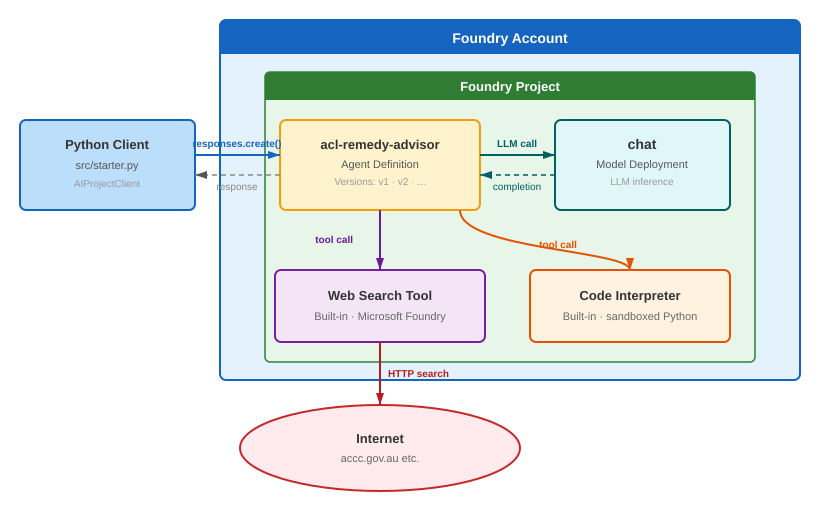

> [!TIP]
> Tick the checkbox next to each step as you complete it. Your progress is saved in this browser and shown on the [workshop overview](../index.html).

## Objectives

- Add the **Code Interpreter** tool to the agent for precise calculations.
- Update the instructions so the model knows *when* to use each tool.
- Run an **automatic evaluation** in the portal and read the per‑evaluator scores.

## Concepts

### Multiple tools and instruction routing

An agent can hold several tools at once. On each turn the model decides which — if any — to call, based on two things: the user's message and **your instructions**. Precise instructions ("use code interpreter to calculate refund amounts") make tool selection consistent and predictable, which also makes evaluation results more reliable.

### Evaluations

An **evaluation** runs your agent against a set of test inputs and scores each response with one or more **evaluators**. The portal does this end‑to‑end in the cloud — it can even generate the test data for you. Evaluators relevant to a tool‑using agent include:

| Evaluator | Category | What it measures |
|---|---|---|
| **Tool Call Accuracy** | Agents | Did the agent call the right tool with the right arguments? |
| **Task Adherence** | Agents | Does the final response fully satisfy the request? |
| **Intent Resolution** | Agents | Did the agent's first actions match the user's intent? |
| **Groundedness / Relevance** | Quality | Is the answer grounded and on‑topic? |
| **Safety** (Violence, Self‑harm, …) | Safety | Does any response contain harmful content? |

> [!NOTE]
> Evaluators that use an LLM judge require a deployed chat model in your project (your Module 01 `chat` deployment is sufficient). Running evaluations consumes model quota.

## Steps

### Part 1 — Add Code Interpreter to the agent

- [ ] In the [Foundry portal](https://ai.azure.com), open **Build → Agents** and select **acl-remedy-advisor**.

- [ ] In the **Tools** section (which already lists **Web search** from Module 04), click **+ Add tools**.

- [ ] Select **Code Interpreter** from the catalog and confirm to add it.

- [ ] Confirm both **Web search** and **Code Interpreter** now appear in the agent's Tools section.

  <details>
  <summary>📸 Reference — the tool picker in the VS Code Agent Builder</summary>

  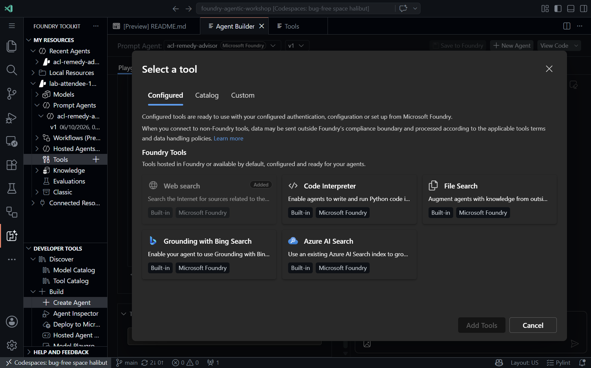

  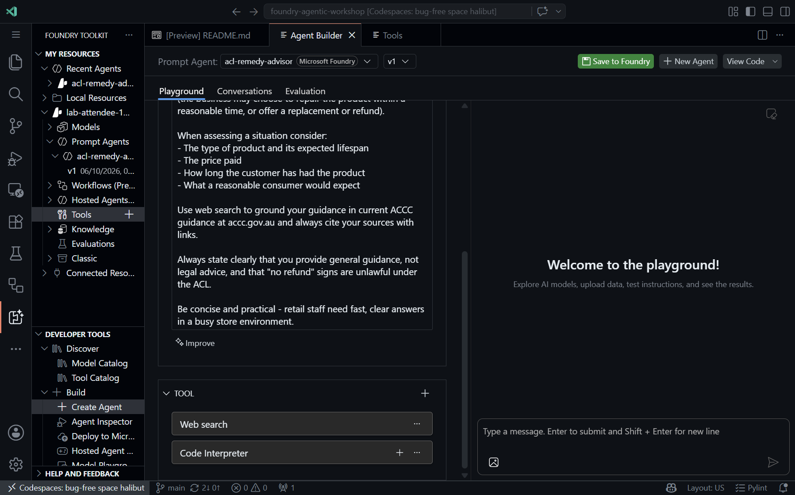

  The portal catalog offers the same **Code Interpreter** tool. Code Interpreter runs sandboxed Python and is billed per active session.

  </details>

### Part 2 — Update the instructions

- [ ] Scroll to the **Instructions** field and add this paragraph to the end of the existing instructions:

  ```text
  When asked to calculate refund amounts, depreciation, pro-rata warranty
  values, or compare prices, use code interpreter to perform the calculation
  precisely and show your working.
  ```

- [ ] Confirm the new paragraph appears at the bottom of the instructions.

> [!NOTE]
> Foundry records this change as a new agent **version** automatically (conceptually your `v2`). Earlier versions remain available, and anything referencing the agent by name uses the latest version.

### Part 3 — Test both tools in the Playground

- [ ] Open the **Playground** tab and send:

  > A customer bought a $899 laptop 14 months ago. The battery now only holds 20% of its original capacity after normal use. The manufacturer's warranty was 12 months. What are the customer's rights under Australian Consumer Law, and what would a reasonable refund amount be if they've had 14 months of use from a product expected to last at least 3 years?

- [ ] Review the response. Confirm the agent classifies the failure, explains the remedy options, and cites current ACCC guidance.

  > The prompt is designed to trigger Web search for ACL guidance and Code Interpreter for the refund calculation. The model exercises judgement — if the calculation does not fire, iterate on the wording. Evaluation (next) gives you a repeatable way to measure this.

### Part 4 — Run an automatic evaluation in the portal

- [ ] With **acl-remedy-advisor** open, click the **Evaluation** tab, then click **+ Create**.

  <details>
  <summary>📸 Screenshot: the Evaluation tab</summary>

  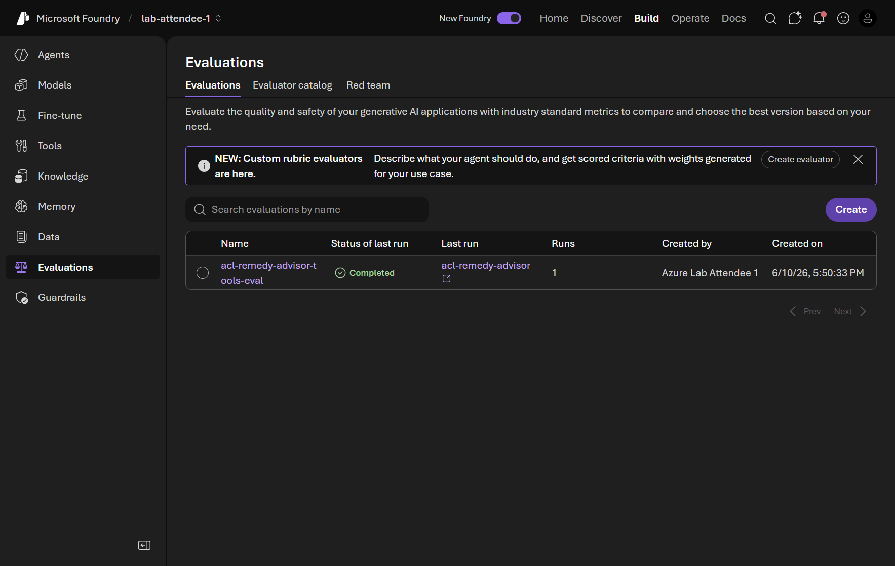

  </details>

- [ ] **Step 1 — Target:** keep **Agent** selected; `acl-remedy-advisor` is pre‑checked. Click **Next**.

  <details>
  <summary>📸 Screenshot: Step 1 Target</summary>

  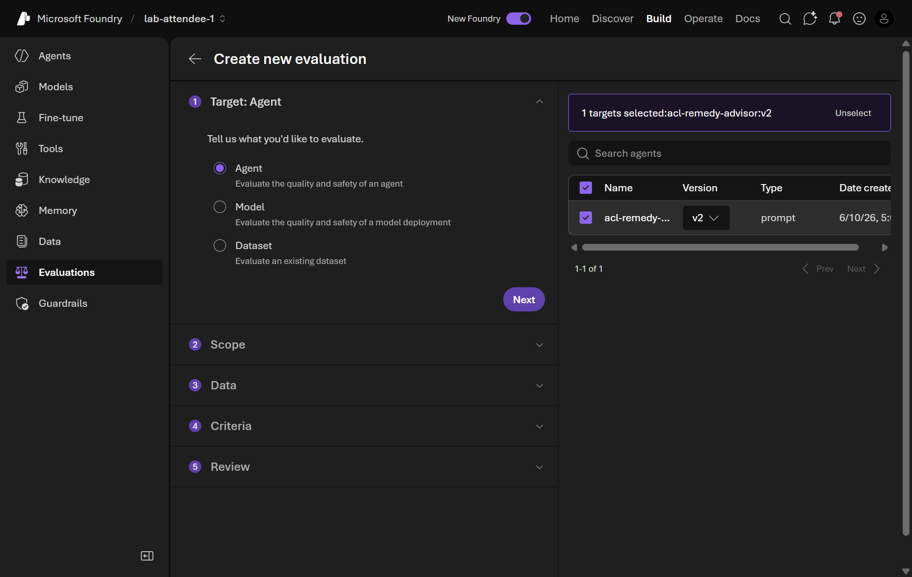

  </details>

- [ ] **Step 2 — Scope:** keep **Individual turns** selected (per‑turn tool‑accuracy scores are easy to read). Click **Next**.

  <details>
  <summary>📸 Screenshot: Step 2 Scope</summary>

  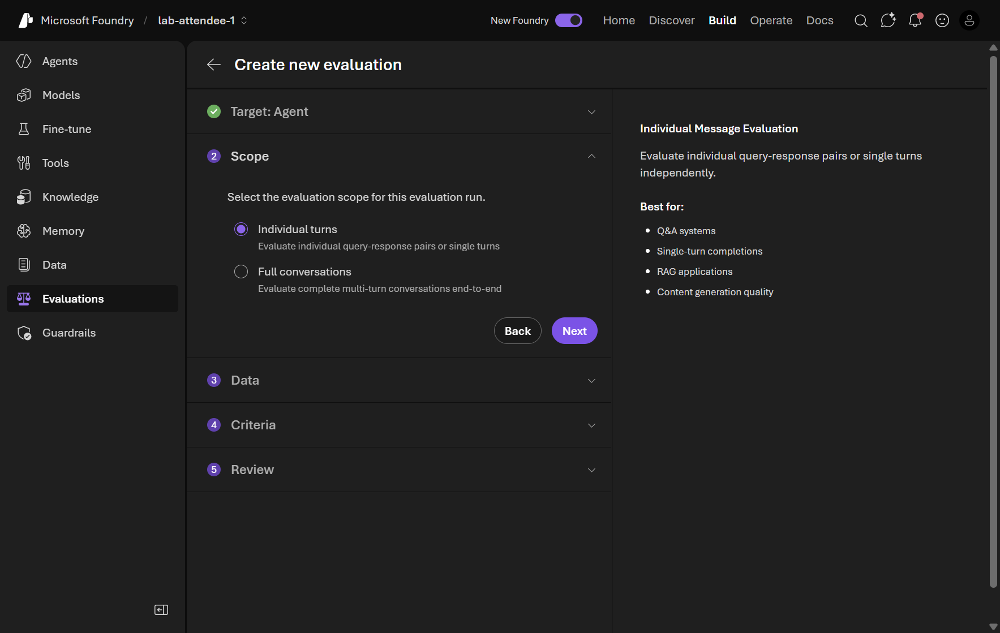

  </details>

- [ ] **Step 3 — Data:** keep **Synthetic generation** selected and click **Generate**. In the dialog, set **Number of rows** to **5**, confirm the **Model** is your `chat` deployment, and paste this prompt:

  ```text
  Generate questions a retail staff member might ask about Australian
  Consumer Law remedies for common product faults: faulty electronics,
  broken appliances, defective clothing, and expired warranties. Include
  at least one question requiring a refund calculation.
  ```

  Click **Confirm**, then **Next**.

  <details>
  <summary>📸 Screenshot: Step 3 Data (synthetic dataset)</summary>

  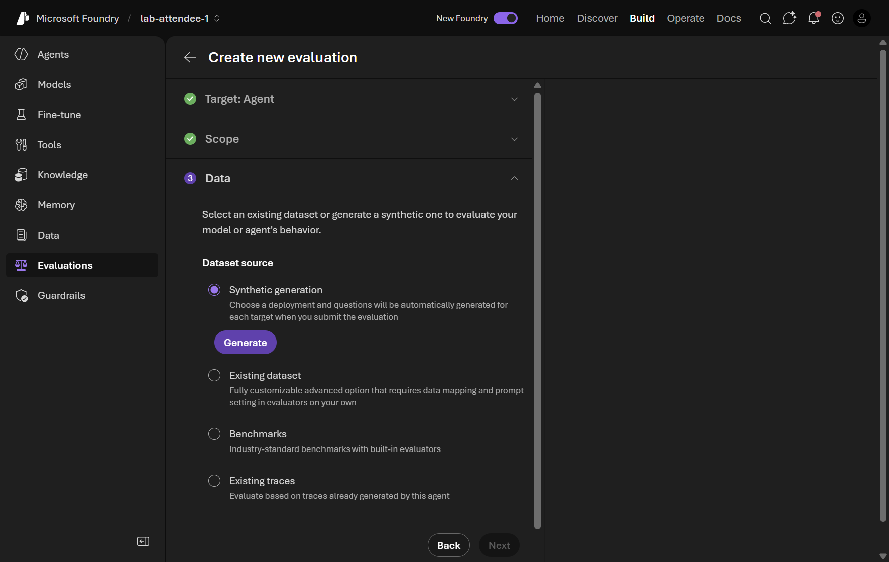

  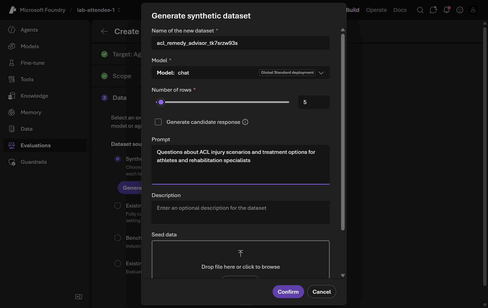

  </details>

- [ ] **Step 4 — Criteria:** the portal auto‑selects evaluators across **Agents**, **Quality**, and **Safety**, and maps the dataset fields for you. Leave the selection as suggested and click **Next**.

  <details>
  <summary>📸 Screenshot: Step 4 Criteria</summary>

  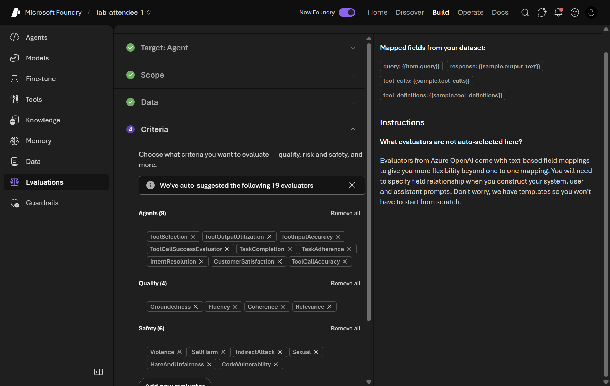

  </details>

- [ ] **Step 5 — Review:** name the evaluation `acl-remedy-advisor-tools-eval` and click **Submit**.

  <details>
  <summary>📸 Screenshot: Step 5 Review</summary>

  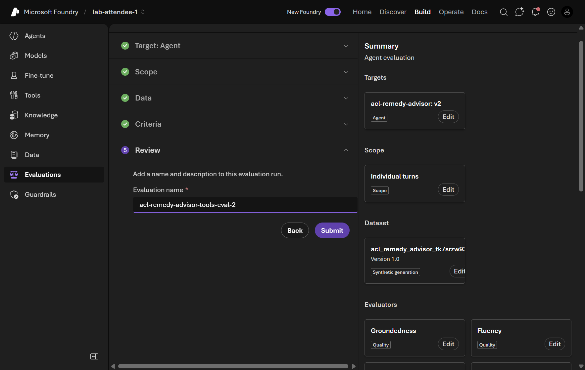

  </details>

- [ ] Wait for the run **Status** to reach **Completed** (a few minutes for 5 rows), then open the run to see per‑evaluator scores for each row.

  <details>
  <summary>📸 Screenshot: evaluation run and results</summary>

  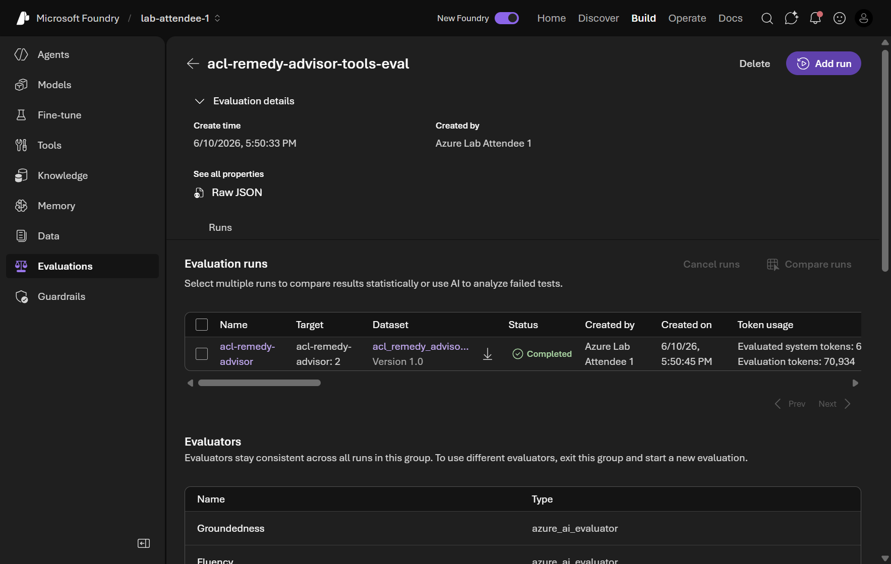

  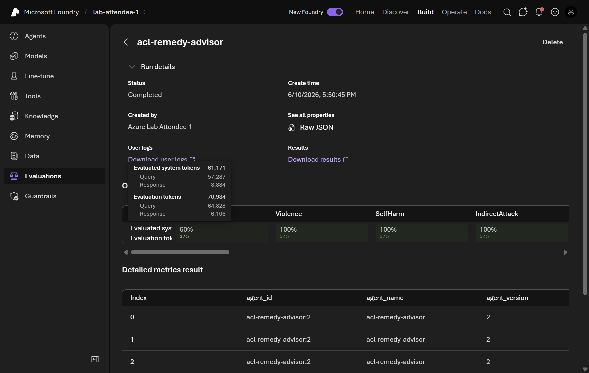

  </details>

- [ ] Look at **ToolCallAccuracy** and **TaskAdherence** (are scores consistently high?), any **Safety** flags, and any low **Groundedness** rows.

  > These scores are a baseline. After you change instructions or add tools, re‑run the same evaluation and compare — a higher ToolCallAccuracy means the agent is following your tool‑usage instructions more reliably.

## Validation

- [ ] `acl-remedy-advisor` has both **Web search** and **Code Interpreter** attached.
- [ ] The instructions include the Code Interpreter routing paragraph.
- [ ] An evaluation named `acl-remedy-advisor-tools-eval` shows **Completed** with per‑evaluator scores.

<div class="source-cta">
<svg viewBox="0 0 24 24" fill="none" stroke="currentColor" stroke-width="1.8" stroke-linecap="round" stroke-linejoin="round"><path d="M18 13v6a2 2 0 0 1-2 2H5a2 2 0 0 1-2-2V8a2 2 0 0 1 2-2h6"/><path d="M15 3h6v6"/><path d="M10 14 21 3"/></svg>
<div>
<div class="t">Want evaluations in CI/CD?</div>
The original workshop also scaffolds a local <code>pytest-agent-evals</code> suite you can run in a pipeline. <a href="https://github.com/PlagueHO/foundry-agentic-workshop/blob/main/labs/introduction-foundry-agent-service/05-agent-tools-and-evaluations/README.md" target="_blank" rel="noopener">Open Module 05 on GitHub →</a>
</div>
</div>
