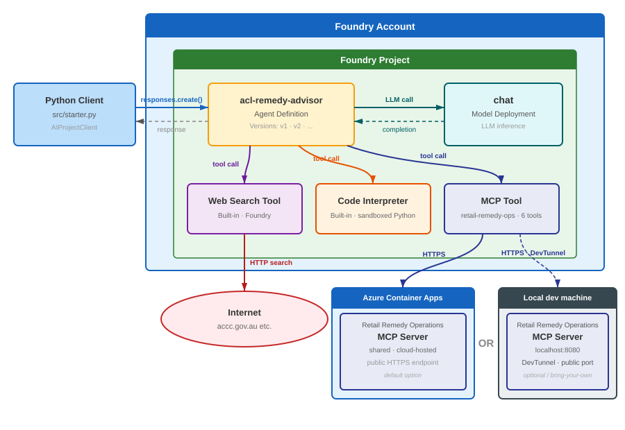
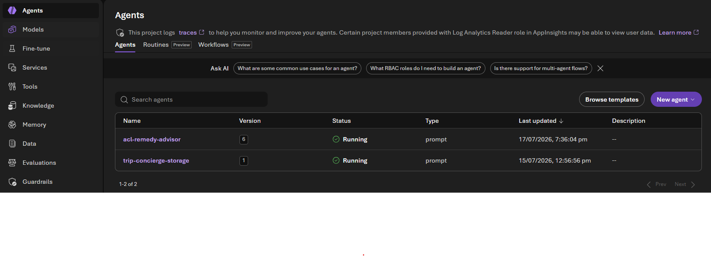
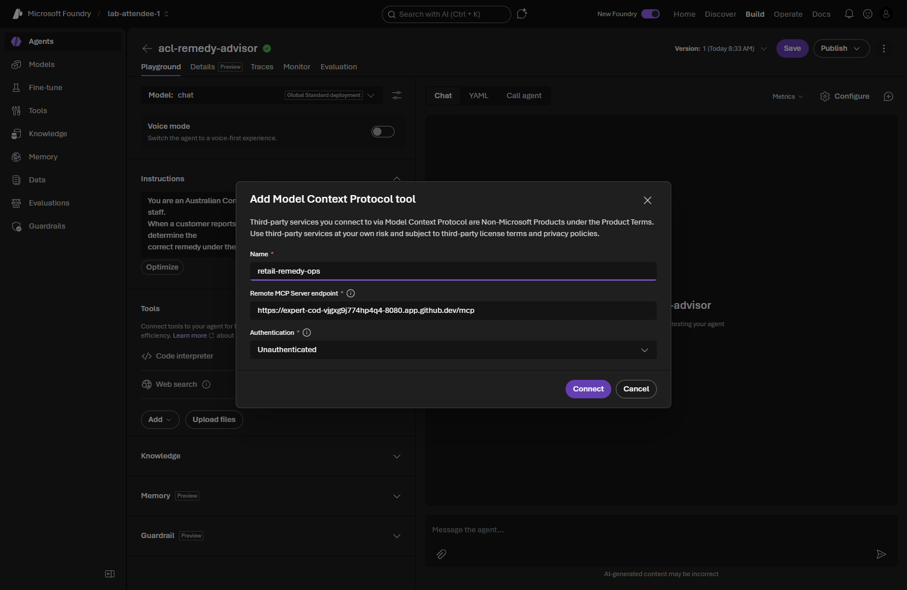
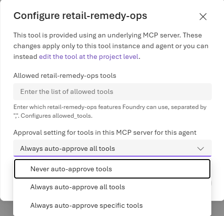
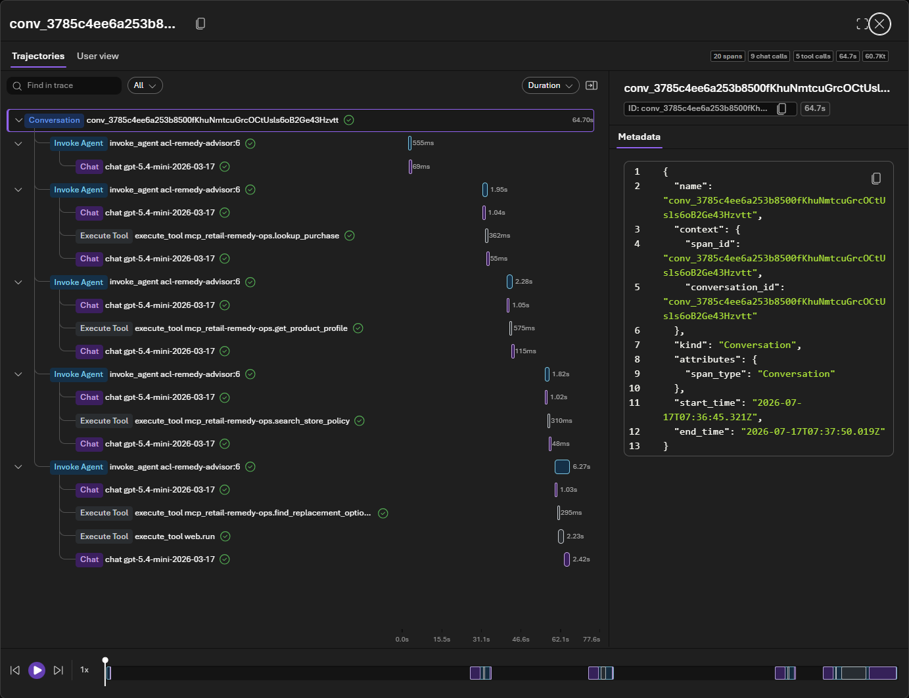
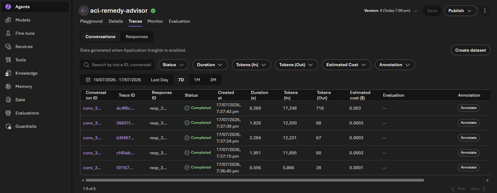

In this module you connect an external **MCP (Model Context Protocol) server** to `acl-remedy-advisor` so it can look up real purchase records, product profiles, and store policies instead of guessing. You wire the tool, set its approval behaviour, and test it — all in the **Foundry portal**.



> [!TIP]
> Tick the checkbox next to each step as you complete it. Your progress is saved in this browser and shown on the [workshop overview](../index.html).

> [!IMPORTANT]
> This module requires a **running MCP server** that the agent can reach over HTTPS. The workshop's sample **`retail-remedy-ops`** server is open source — in your own subscription, deploy it (for example to Azure Container Apps) or point the agent at any MCP server you operate. The portal steps below are identical regardless of which server you use; only the URL changes. See the [source repo](https://github.com/PlagueHO/foundry-agentic-workshop/tree/main/shared/mcp-servers/retail-remedy-ops) for the sample server and deployment.

## Objectives

- Add a custom **MCP tool** to the agent in the portal by URL.
- Update the instructions so the model calls the MCP tools at the right time.
- Configure **tool‑call approvals** and test the agent end‑to‑end.

## Concepts

### What MCP gives the agent

MCP is an open standard that lets an agent call tools hosted by an external server. The sample `retail-remedy-ops` server exposes retail operations tools such as `lookup_purchase`, `get_product_profile`, `search_store_policy`, `find_replacement_options`, `draft_remedy_summary`, and `create_remedy_case`. With these attached, the agent can answer questions grounded in your systems of record rather than general knowledge.

### Tool‑call approvals

Because MCP tools can act on your data, Foundry can pause and ask you to **approve** each tool call (human‑in‑the‑loop). In the portal the default is **Never auto‑approve tools**, so you approve calls as they happen — and you can later switch to auto‑approve or restrict which tools are allowed.

## Steps

### Part 1 — Get your MCP server URL

- [ ] Obtain the base URL of your running MCP server. It ends in `/mcp`, for example:

  ```text
  https://ca-mcp-<env>.<region>.azurecontainerapps.io/mcp
  ```

- [ ] *(Optional)* Confirm it responds — opening the URL should return a JSON‑RPC error about requiring `text/event-stream` rather than failing to connect. Keep the URL handy.

### Part 2 — Add the MCP tool in the portal

- [ ] In the [Foundry portal](https://ai.azure.com), open **Build → Agents** and select **acl-remedy-advisor**.

  <details>
  <summary>📸 Screenshot: the Agents list in the portal</summary>

  

  </details>

- [ ] In the **Tools** section, click **+ Add tools** and choose the **Custom** category, then **Model Context Protocol (MCP)**.

- [ ] Fill in the connection details:

  | Field | Value |
  |---|---|
  | Label / Name | `retail-remedy-ops` |
  | Server URL | your MCP server URL, ending in `/mcp` |
  | Authentication | None / Anonymous *(sample server only)* |

  > [!IMPORTANT]
  > Anonymous access is for this sample only. In production, secure your MCP server and configure the matching authentication here — never expose an unauthenticated tool server permanently.

- [ ] Confirm and add the tool. Verify `retail-remedy-ops` now appears in the agent's **Tools** section alongside Web search and Code Interpreter.

  <details>
  <summary>📸 Screenshot: configuring the MCP tool in the portal</summary>

  

  </details>

### Part 3 — Update the agent instructions

- [ ] In the **Instructions** field, add this paragraph to the end:

  ```text
  Use the retail operations MCP tools when a question includes a receipt ID,
  customer ID, or product ID, or when staff ask about store policy, warranty
  details, or replacement availability. Call lookup_purchase first to retrieve
  the purchase record, then get_product_profile for lifespan and warranty data,
  search_store_policy for relevant policy excerpts, and find_replacement_options
  if the customer may want a replacement. Use draft_remedy_summary to produce a
  structured summary for the staff member. Use create_remedy_case to log the
  outcome if the staff member confirms the remedy. Do not invent purchase,
  warranty, policy, or stock details - call the MCP tools instead.
  ```

- [ ] Confirm the paragraph is saved (Foundry records a new agent version automatically).

### Part 4 — Configure approvals and test

- [ ] To review or change approval behaviour, click the **…** next to the MCP tool and choose **Configure**. The portal default is **Never auto‑approve tools**; you can switch to **Always auto‑approve** or restrict the allowed tools.

  <details>
  <summary>📸 Screenshot: MCP tool approval configuration in the portal</summary>

  

  </details>

- [ ] Open the **Playground** tab and send:

  ```text
  Receipt R-1007 is for a laptop bought by customer C-1042. The battery now only
  holds 20% charge after 14 months of normal use. Check our records and store
  policy, then advise the retail staff member what remedy to offer under Australian
  Consumer Law. Include any replacement options and calculate a reasonable
  pro-rata refund.
  ```

- [ ] When an **Approve / Deny** prompt appears for a tool call, click **Approve** (or **Always approve this tool**). Approve each MCP call as the agent runs.

- [ ] Confirm the final answer:
  - Calls MCP tools in sequence (e.g. `lookup_purchase`, `get_product_profile`, `search_store_policy`).
  - Uses Code Interpreter to calculate the pro‑rata refund.
  - Gives a clear remedy recommendation citing store policy and the ACL.

  <details>
  <summary>📸 Screenshot: the completed conversation in the portal</summary>

  

  </details>

### Part 5 — Inspect the run trace

- [ ] Open the agent's **Traces** tab (connect Application Insights to your project first if prompted — see Module 11). The trace shows the exact sequence of MCP tool calls, model reasoning, and Code Interpreter invocations.

  <details>
  <summary>📸 Screenshot: agent traces in the portal</summary>

  

  </details>

## Validation

- [ ] `retail-remedy-ops` appears in the agent's **Tools** section.
- [ ] The instructions include the MCP tool‑boundary paragraph.
- [ ] A Playground run calls the MCP tools and returns a policy‑ and ACL‑grounded remedy with a pro‑rata refund.

<div class="source-cta">
<svg viewBox="0 0 24 24" fill="none" stroke="currentColor" stroke-width="1.8" stroke-linecap="round" stroke-linejoin="round"><path d="M18 13v6a2 2 0 0 1-2 2H5a2 2 0 0 1-2-2V8a2 2 0 0 1 2-2h6"/><path d="M15 3h6v6"/><path d="M10 14 21 3"/></svg>
<div>
<div class="t">Need the MCP server, or a code path?</div>
The source lab includes the sample <code>retail-remedy-ops</code> server, its deployment, a local dev‑tunnel option, and a script that adds the MCP tool via the API. <a href="https://github.com/PlagueHO/foundry-agentic-workshop/blob/main/labs/introduction-foundry-agent-service/06-mcp-tools/README.md" target="_blank" rel="noopener">Open Module 06 on GitHub →</a>
</div>
</div>
