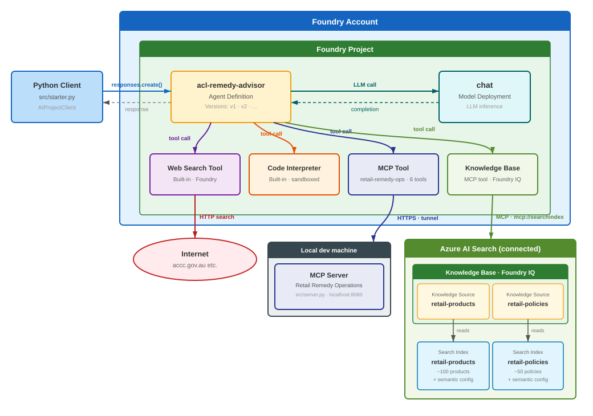
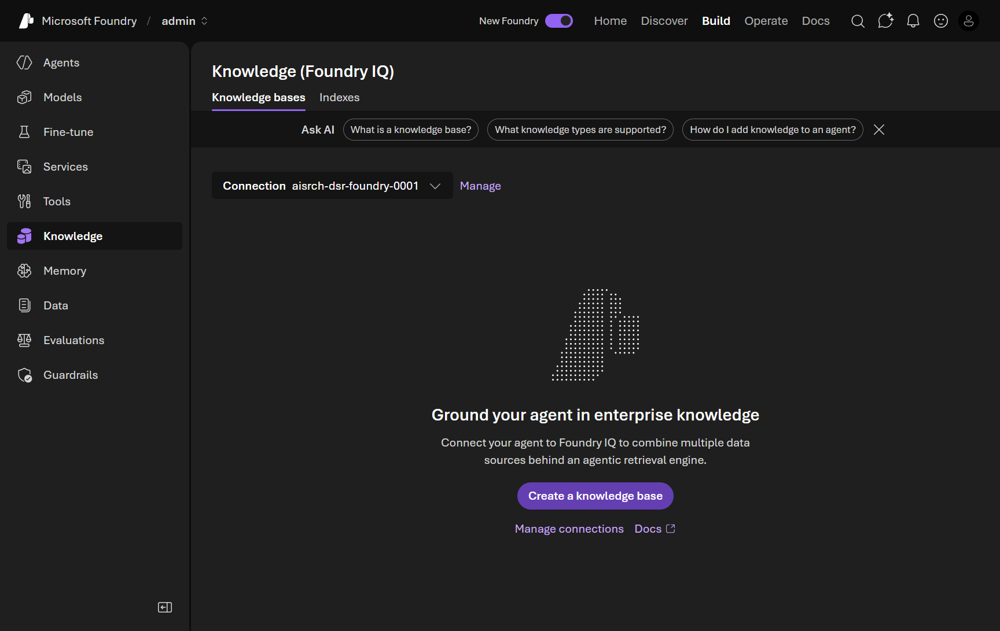
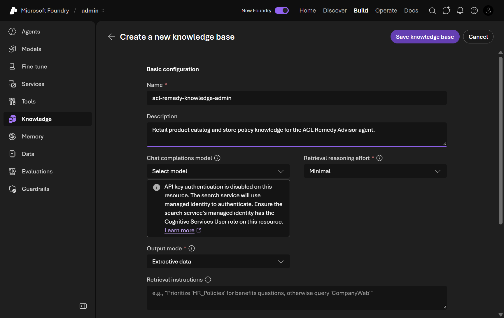
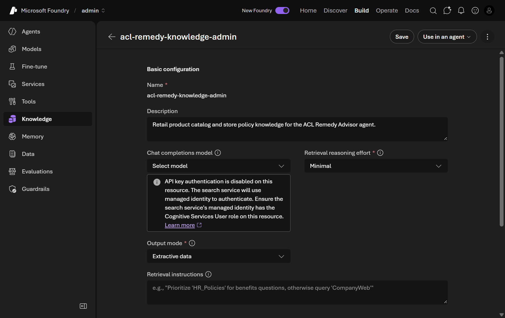
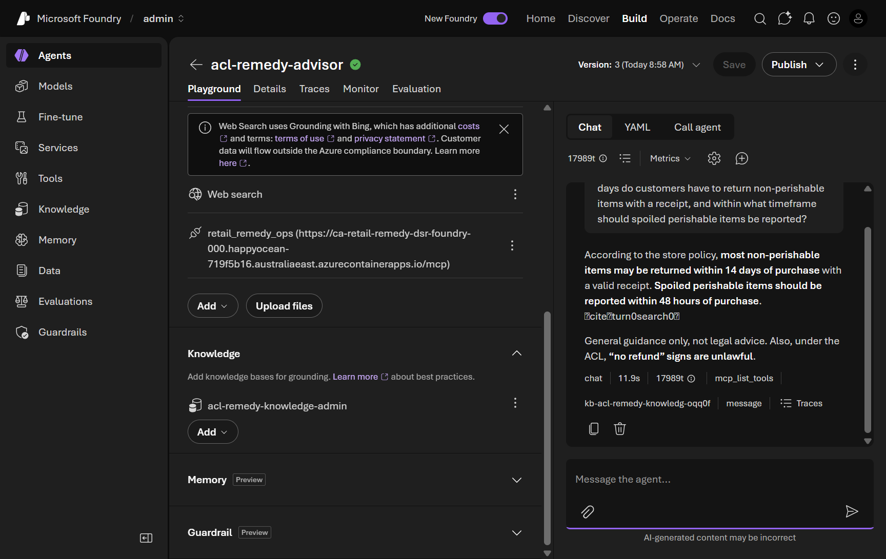
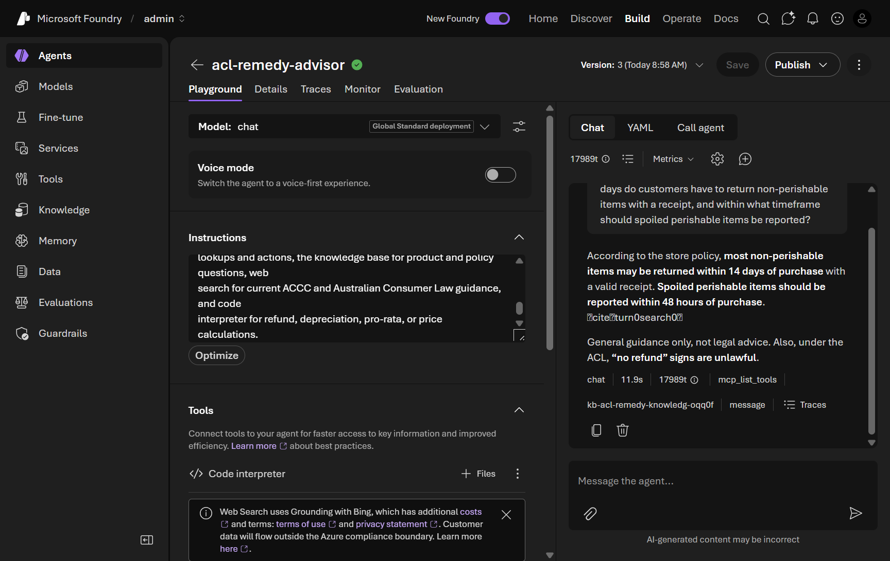

In this module you **ground** `acl-remedy-advisor` in your store's own product and policy data so it answers from trusted sources instead of general knowledge. You do it entirely in the **Foundry portal**, using either of two portal‑native paths:

- **Path A — File Search (recommended):** upload policy/product documents straight to the agent. No extra Azure resources required.
- **Path B — Foundry IQ knowledge base (enterprise):** connect one or more **Azure AI Search** indexes as a reusable knowledge layer.



> [!TIP]
> Tick the checkbox next to each step as you complete it. Your progress is saved in this browser and shown on the [workshop overview](../index.html). You only need to complete **one** of the two paths below.

## Objectives

- Ground the agent in your own documents or search indexes — in the portal.
- Add a **routing instruction** so the agent prefers grounded knowledge for product and policy questions.
- Confirm answers are grounded and cited, and that existing tools still route correctly.

## Concepts

**Grounding** means giving the model trusted, retrievable content so its answers reflect *your* current catalog and policies rather than training‑data conventions.

| Portal path | Backing store | Best for |
|---|---|---|
| **File Search** | Files you upload to the agent | Quick start; a handful of policy/product docs; no extra resources |
| **Foundry IQ knowledge base** | Azure AI Search index(es) | Large or shared corpora; reusable across agents; enterprise scale |

> [!NOTE]
> Foundry IQ knowledge bases are managed on the **Knowledge** page and are currently a **preview** portal feature. Creating one typically needs the **foundry‑project‑manager** role (or higher) and an **Azure AI Search** service connected to your project, with your content already indexed.

## Path A — Ground with File Search (recommended)

### 1. Prepare a policy document

- [ ] Save the following as a file named `store-return-policy.md` (or use your own policy/product documents):

  ```text
  # Retail Store — Returns & Remedies Policy

  ## Non-perishable goods
  Customers may return non-perishable items within 14 days with a valid
  receipt for a refund, exchange, or store credit, provided the item is in
  resalable condition.

  ## Perishable goods
  Spoiled or defective perishable items should be reported within 48 hours
  of purchase for a full refund or replacement.

  ## Warranty and major failures
  For a major failure, the customer chooses the remedy: refund, replacement,
  or repair. "No refund" signs are unlawful under the Australian Consumer Law.
  ```

### 2. Add File Search to the agent

- [ ] In the [Foundry portal](https://ai.azure.com), open **Build → Agents** and select **acl-remedy-advisor**.

- [ ] In the **Tools / Knowledge** area, click **+ Add tools** and choose **File Search**.

- [ ] **Upload** `store-return-policy.md` (and any product docs). Wait for Foundry to index the file, then confirm **File Search** is listed on the agent.

  <div class="shot-placeholder">
  <svg viewBox="0 0 24 24" fill="none" stroke="currentColor" stroke-width="1.8" stroke-linecap="round" stroke-linejoin="round"><path d="M14.5 4h-5L7 7H4a2 2 0 0 0-2 2v9a2 2 0 0 0 2 2h16a2 2 0 0 0 2-2V9a2 2 0 0 0-2-2h-3l-2.5-3Z"/><circle cx="12" cy="13" r="3.5"/></svg>
  <span><strong>Add your own screenshot:</strong> the <em>File Search</em> upload dialog on your agent.</span>
  </div>

### 3. Add a grounding instruction

- [ ] In the **Instructions** field, add:

  ```text
  For questions about store policies (returns, refunds, warranties) or specific
  products (names, prices, availability), retrieve the answer from the uploaded
  knowledge with File Search and cite it. Prefer this grounded knowledge over
  your training knowledge for all product and policy questions.
  ```

### 4. Test grounded retrieval

- [ ] Open the **Playground** and send:

  > According to our store's return policy, how many days do customers have to return non-perishable items with a receipt, and within what timeframe should spoiled perishable items be reported?

- [ ] Confirm the agent answers **14 days** (non‑perishable) and **48 hours** (perishable) and cites the uploaded document rather than generic retail conventions.

> [!TIP]
> This question has no receipt or customer ID, so the agent grounds from your uploaded knowledge and does not call the `retail-remedy-ops` MCP tools — the routing you set up in earlier modules stays intact.

## Path B — Ground with a Foundry IQ knowledge base (enterprise)

> [!IMPORTANT]
> Prerequisites: an **Azure AI Search** service connected to your project with your content **already indexed** (this workshop's scenario uses `retail-products` and `retail-policies` indexes), the **foundry‑project‑manager** role, and access to the preview **Knowledge (Foundry IQ)** page.

### 1. Create the knowledge base

- [ ] In the portal, open your project and click **Knowledge** in the left navigation. Confirm the heading reads **Knowledge (Foundry IQ)** and the connected Azure AI Search service is pre‑selected.

  <details>
  <summary>📸 Screenshot: the Knowledge (Foundry IQ) page</summary>

  

  </details>

- [ ] Click **Create a knowledge base**. Set a **Name**, leave **Retrieval reasoning effort** at **Minimal** and **Output mode** at **Extractive data** (the defaults — fastest and lowest cost), and leave **Retrieval instructions** empty.

  <details>
  <summary>📸 Screenshot: create knowledge base — basic configuration</summary>

  

  </details>

- [ ] Under **Knowledge sources**, click **Add sources → Azure AI Search Index**, name the source (e.g. `retail-policies`), pick the matching index, and click **Create**. Repeat for any other indexes (e.g. `retail-products`), then click **Save knowledge base**.

  <details>
  <summary>📸 Screenshot: knowledge base created with sources active</summary>

  

  </details>

### 2. Attach it to the agent

- [ ] On the knowledge base page, click **Use in an agent** and select **acl-remedy-advisor**. On the agent's Playground page, confirm a **Knowledge** section now lists the knowledge base, separate from the **Tools** section.

  <details>
  <summary>📸 Screenshot: agent with the Knowledge section added</summary>

  

  </details>

### 3. Add tool‑routing instructions

- [ ] In the **Instructions** field, add the following (this reinforces every capability so no tool is left unused):

  ```text
  When a staff member provides a receipt ID, order ID, or customer ID - or asks
  you to look up a purchase, verify an order, or open a support case - use the
  retail-remedy-ops tools. Never invent receipt, order, or case details.

  When answering questions about specific products (names, descriptions,
  categories, prices, ratings, stock) or store policies (return windows, refund
  eligibility, warranty coverage, loyalty rules, store-brand guarantees), use the
  knowledge base to retrieve the answer and cite the source. Prefer knowledge base
  retrieval over your training knowledge for all product and policy questions.

  To summarise routing: retail-remedy-ops tools for operational lookups and
  actions, the knowledge base for product and policy questions, web search for
  current ACCC and Australian Consumer Law guidance, and code interpreter for
  refund, depreciation, pro-rata, or price calculations.
  ```

  > [!NOTE]
  > An **Optimize** button may appear below the Instructions panel. Do not use it here — it rewrites instructions with AI and would replace the routing text you just added.

### 4. Test grounded retrieval

- [ ] Open the **Playground** and send the same policy query used in Path A. Confirm the agent answers **14 days** / **48 hours**, includes source citation markers, and shows a `kb-…` tool chip in the response metadata.

  <details>
  <summary>📸 Screenshot: grounded policy response</summary>

  

  </details>

## Validation

- [ ] The agent is grounded via **File Search** (Path A) or a **Foundry IQ knowledge base** (Path B).
- [ ] Policy/product questions return **grounded, cited** answers that match your source data.
- [ ] Operational queries (with a receipt ID) still call `retail-remedy-ops`, web search still handles consumer‑law questions, and Code Interpreter still calculates — grounding did not displace the existing tools.

<div class="source-cta">
<svg viewBox="0 0 24 24" fill="none" stroke="currentColor" stroke-width="1.8" stroke-linecap="round" stroke-linejoin="round"><path d="M18 13v6a2 2 0 0 1-2 2H5a2 2 0 0 1-2-2V8a2 2 0 0 1 2-2h6"/><path d="M15 3h6v6"/><path d="M10 14 21 3"/></svg>
<div>
<div class="t">Building the search indexes, or grounding from code?</div>
The source lab includes scripts that seed the <code>retail-products</code> and <code>retail-policies</code> indexes and the full Foundry IQ walkthrough (output modes, retrieval effort, and routing). <a href="https://github.com/PlagueHO/foundry-agentic-workshop/blob/main/labs/introduction-foundry-agent-service/07-foundry-iq/README.md" target="_blank" rel="noopener">Open Module 07 on GitHub →</a>
</div>
</div>
