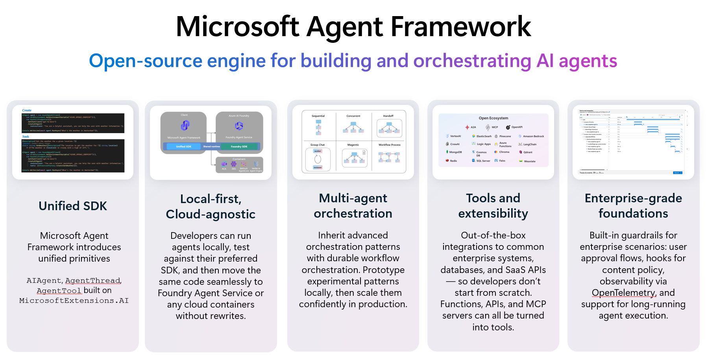

So far you build and test the `acl-remedy-advisor` agent entirely in the Foundry portal. The portal is excellent for designing, grounding, and testing a single agent — but real applications call agents from **code**. That is where the **Microsoft Agent Framework** comes in.

> [!NOTE]
> This is a **read-only concept** module in the portal-first workshop. It requires a Python environment (and the agent you grounded in [Module 07](07-foundry-iq.html)). Read it to understand how the portal agent gets consumed from code; do the full hands-on from the source lab when you're ready to write code.

## What the Agent Framework is

The **Microsoft Agent Framework** is an open-source SDK (Python and .NET) for building, running, and orchestrating AI agents and multi-agent workflows. It unifies the lessons of Semantic Kernel and AutoGen into one consistent programming model that works the same across model providers.

## Why it exists

A chat playground gets you a working agent, but a production app needs more:

- Call an agent from your own app, API, or background job.
- Add custom logic and your own function tools around the agent.
- Stream responses to a UI as they're generated.
- Orchestrate several agents into a multi-agent workflow.
- Add observability, middleware, and consistent error handling.

## Two ways to work with Foundry

| Pattern | What it does | Used in |
|---|---|---|
| **`FoundryAgent`** | Binds to an agent that already exists in Foundry (by name). Its model, instructions, and tools live on the service — you just connect and run. | This module |
| **`FoundryChatClient` + `Agent`** | Declares a model, instructions, and tools directly in code. | Module 10 |

The hands-on connects to the grounded `acl-remedy-advisor` Prompt Agent from Module 07, runs it from Python, prints the response, then streams it — authenticating with `DefaultAzureCredential` so no keys appear in your code.

## Why it matters

This is the bridge from "agent I clicked together in the portal" to "agent my application calls in production." Same agent, now driven by code, with room for custom tools, streaming, and orchestration.

<svg viewBox="0 0 24 24" fill="none" stroke="currentColor" stroke-width="1.8" stroke-linecap="round" stroke-linejoin="round"><path d="M18 13v6a2 2 0 0 1-2 2H5a2 2 0 0 1-2-2V8a2 2 0 0 1 2-2h6"/><path d="M15 3h6v6"/><path d="M10 14 21 3"/></svg>

Concept module — full hands-on lives in the source lab

The complete Python walkthrough (connect, run, stream) is in the original workshop. <a href="https://github.com/PlagueHO/foundry-agentic-workshop/blob/main/labs/introduction-foundry-agent-service/08-agent-framework-python/README.md" target="_blank" rel="noopener">Open Module 08 on GitHub →</a>

