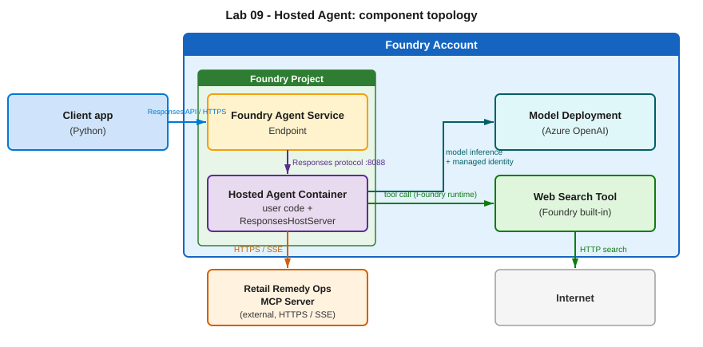

A **Prompt Agent** (Modules 04–07) is configured *declaratively* on the Foundry service — you give it a model, instructions, and tools, and Foundry runs it. A **hosted agent** is different: *you* write the agent as a container that Foundry hosts and scales, while Foundry provides a managed endpoint, autoscaling, observability, and a dedicated identity.

> [!NOTE]
> Hosted agents are a **preview** feature and the full hands-on requires Python packaging and deployment. This is a **read-only concept** module in the portal-first workshop — read it to understand the hosted-agent model, then follow the source lab when you want to deploy one.

## What a hosted agent is — and when to use one

Use a hosted agent when you need full control of the agent's orchestration — custom tools, your own libraries, or logic that doesn't fit the declarative Prompt Agent model — but still want a fully managed, serverless endpoint.

## How it works

- **Responses protocol** — a hosted agent speaks the OpenAI-compatible **Responses** protocol. You don't implement that server by hand: the Agent Framework's `ResponsesHostServer` wraps your `Agent` and serves the protocol for you.
- **Its own identity** — every hosted agent gets its **own Microsoft Entra agent identity** at deploy time. That identity (not yours) calls models and tools at runtime, with implicit access to inference and session storage inside its own project.
- **Wired to real tools** — the workshop's hosted agent exposes the live `retail_remedy_ops` MCP server from [Module 06](06-mcp-tools.html) plus the Foundry hosted **web search** tool.

## Two ways to deploy

| Path | Result | Notes |
|---|---|---|
| **From a container image** | `…-hosted-container` | Build with Docker, push to a registry, point Foundry at the image. *Skipped in the current preview.* |
| **From source code** (recommended) | `…-hosted-code` | Hand Foundry a zip of the agent bundle; it builds the image remotely — no local Docker. |

## Why it matters

This is the step from "declarative agent in the portal" to "your own code, running fully managed." It's the foundation for the toolbox capstone in [Module 10](10-foundry-toolboxes.html), which deploys a new version of this same hosted agent.

<svg viewBox="0 0 24 24" fill="none" stroke="currentColor" stroke-width="1.8" stroke-linecap="round" stroke-linejoin="round"><path d="M18 13v6a2 2 0 0 1-2 2H5a2 2 0 0 1-2-2V8a2 2 0 0 1 2-2h6"/><path d="M15 3h6v6"/><path d="M10 14 21 3"/></svg>

Concept module — full hands-on lives in the source lab

The complete deploy-and-invoke walkthrough (source-code deploy, multi-turn conversation) is in the original workshop. <a href="https://github.com/PlagueHO/foundry-agentic-workshop/blob/main/labs/introduction-foundry-agent-service/09-hosted-agents/README.md" target="_blank" rel="noopener">Open Module 09 on GitHub →</a>

