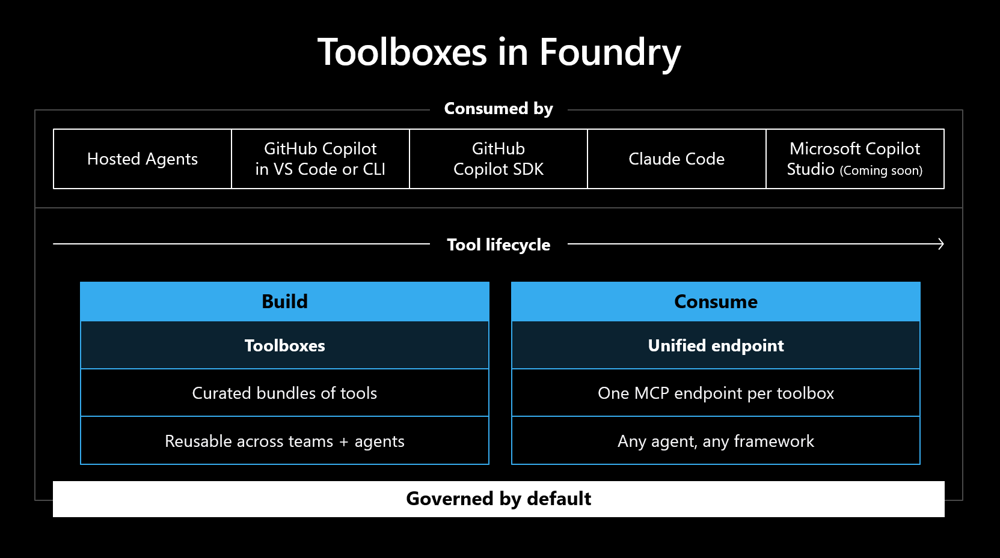

A **Foundry Toolbox** is a centrally managed collection of tools exposed through a single MCP-compatible endpoint. Instead of each agent wiring its own connections, you define the tools once in a toolbox and any agent connects to one URL. This capstone bundles the **Retail Remedy Operations MCP server**, **Web Search**, and **Code Interpreter** into a single toolbox — and puts **Tool Search** in front of them.

> [!NOTE]
> The toolbox itself is **created in the Foundry portal** (great, portal-first!), but consuming it end-to-end requires deploying a **hosted agent from code** (see [Module 09](09-hosted-agents.html)). Because of that code dependency, this is presented as a **read-only concept** module. Read it for the pattern; follow the source lab to run it fully.

## What is a Toolbox?

| Benefit | Detail |
|---|---|
| **Centralised management** | Rotate credentials, swap servers, or add tools without redeploying agents |
| **Versioning** | Create a new version, test it, then promote it to default |
| **Guardrails** | Apply a named content policy to all tool inputs/outputs at the toolbox layer |
| **Discoverability** | Any agent or MCP client in the org can reuse the same endpoint |

## What is Tool Search?

When a toolbox holds many tools, passing every definition to the model each turn wastes tokens and dilutes focus. **Tool Search** replaces the full list with two meta-tools:

| Meta-tool | What the model does |
|---|---|
| `tool_search` | Describes what it needs in natural language; Foundry returns matching tool definitions |
| `call_tool` | Invokes any tool that `tool_search` returned |

The model never browses a full list — it describes intent, discovers the right tools, and calls them. **Tool descriptions drive match quality**, so every tool needs a clear description.

## Why a hosted agent — not a prompt agent?

The toolbox MCP endpoint is an **authenticated Foundry service**: every request must carry an Entra bearer token scoped to `https://ai.azure.com/.default`. The portal's MCP tool picker can't inject that per-request token, so **prompt agents can't connect to it today**. A **hosted agent** written in code can inject the token itself — which is why the toolbox is consumed from a hosted agent.

## Why it matters

This is the capstone pattern: **one managed agent, one toolbox endpoint, every tool discovered through Tool Search.** It's how you keep a growing set of tools maintainable across many agents.

<svg viewBox="0 0 24 24" fill="none" stroke="currentColor" stroke-width="1.8" stroke-linecap="round" stroke-linejoin="round"><path d="M18 13v6a2 2 0 0 1-2 2H5a2 2 0 0 1-2-2V8a2 2 0 0 1 2-2h6"/><path d="M15 3h6v6"/><path d="M10 14 21 3"/></svg>

Concept module — full hands-on lives in the source lab

The complete walkthrough (build the toolbox in the portal, enable Tool Search, deploy the hosted agent, invoke and inspect it) is in the original workshop. <a href="https://github.com/PlagueHO/foundry-agentic-workshop/blob/main/labs/introduction-foundry-agent-service/10-foundry-toolboxes/README.md" target="_blank" rel="noopener">Open Module 10 on GitHub →</a>

