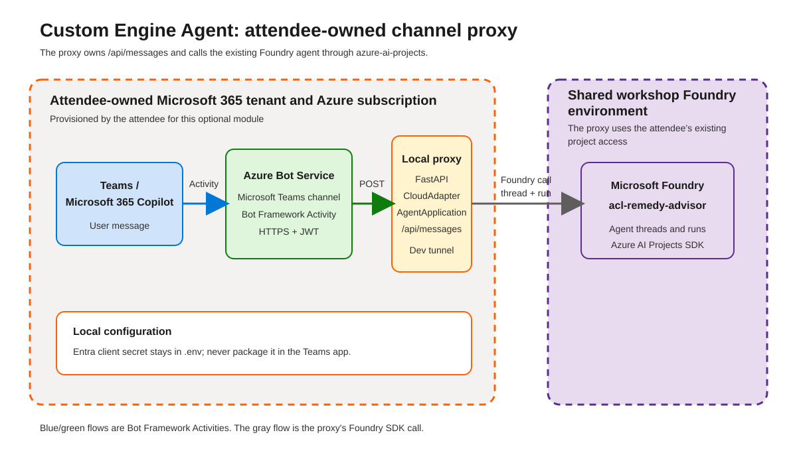

A **Custom Engine Agent** flips the ownership model of [Module 12](12-publishing-agents.html)'s native publishing. Instead of Foundry owning the public endpoint and the bridge to Microsoft 365, **your application** owns the bot endpoint and the orchestration code, while still calling the existing `acl-remedy-advisor` Foundry agent behind the scenes.

> [!IMPORTANT]
> This is an **optional, extra-credit** module and the most involved in the workshop. The hands-on requires **your own Azure subscription and Microsoft Entra tenant**, permission to create an app registration and an Azure Bot Service, a local proxy, and a development tunnel. It's presented here as a **read-only concept** — follow along with a facilitator demo, or use the source lab if you have a suitable tenant.

## Native publishing vs. Custom Engine Agent

| Module 12 — native publishing | Module 13 — custom engine agent |
|---|---|
| Foundry-managed publishing endpoint | Attendee-owned proxy endpoint |
| Foundry manages the Activity-to-Responses bridge | The proxy translates between Activity and Foundry calls |
| Agent configuration stays in Foundry | The proxy owns the web host, identity, and request handling |
| Requires publishing permissions in the project | Requires your own tenant and subscription |

## How it works

1. **Azure Bot Service** forwards Bot Framework **Activity** messages from Teams/M365 to your proxy's `POST /api/messages` route.
2. The **proxy** (a FastAPI app, using the **Microsoft 365 Agents SDK** pattern) authenticates and dispatches the Activity.
3. It calls the existing `acl-remedy-advisor` Foundry agent through `azure-ai-projects` and returns an Activity-shaped reply.

In production, the SDK's `CloudAdapter` validates the Bot Framework JWT on each request and `AgentApplication` routes it to typed handlers; the workshop's simplified solution focuses on the Foundry call.

## What the hands-on involves

- Confirm access and prepare the proxy code.
- Run the FastAPI proxy locally and expose it via a **development tunnel**.
- Provision the **bot identity** and **Azure Bot Service** in your own tenant.
- Package and **sideload** the proxy as a custom **Teams app**.
- Send a test message from Teams and confirm the Foundry agent responds.

## Why it matters

This is the pattern for embedding a Foundry agent into a bespoke channel or product where you need to own the endpoint, identity, and request handling — the opposite end of the spectrum from one-click portal publishing.

<svg viewBox="0 0 24 24" fill="none" stroke="currentColor" stroke-width="1.8" stroke-linecap="round" stroke-linejoin="round"><path d="M18 13v6a2 2 0 0 1-2 2H5a2 2 0 0 1-2-2V8a2 2 0 0 1 2-2h6"/><path d="M15 3h6v6"/><path d="M10 14 21 3"/></svg>

Optional concept module — full hands-on lives in the source lab

The complete walkthrough (proxy, tunnel, Azure Bot Service, Teams sideload) is in the original workshop. <a href="https://github.com/PlagueHO/foundry-agentic-workshop/blob/main/labs/introduction-foundry-agent-service/13-custom-engine-agent/README.md" target="_blank" rel="noopener">Open Module 13 on GitHub →</a>

