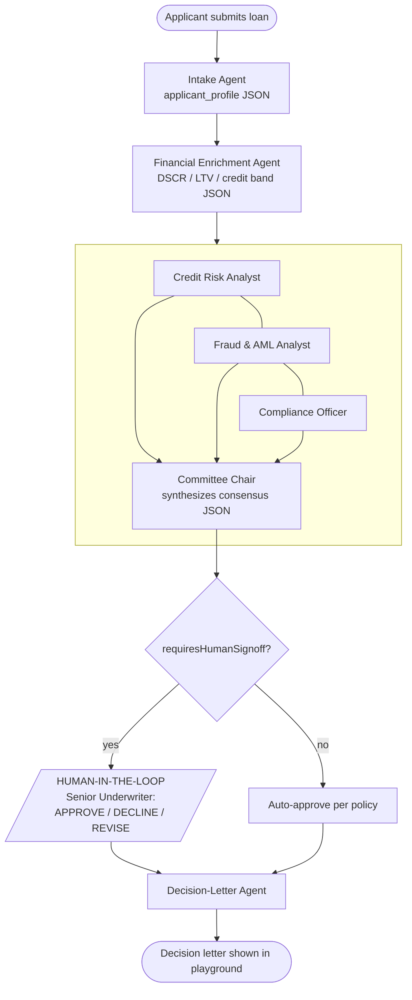

# Commercial Loan Underwriting — Foundry Multi-Agent Workflow

A financial-services **multi-agent workflow** you build in **Microsoft Foundry → Workflows**
(public preview) and run in the **portal playground**. It combines all three orchestration
styles you asked for:

- **Sequential** — an intake pipeline (parse → enrich the application).
- **Group chat** — a moderated **Credit Committee** (Risk + Fraud/AML + Compliance, chaired).
- **Human-in-the-loop** — a **Senior Underwriter** sign-off that pauses the run (conditionally).
- …then a **Decision-Letter** agent drafts the applicant-facing outcome.



> ⚠️ **Preview + retirement notice.** Foundry Workflows are in **public preview** and Microsoft
> is **retiring the visual designer + in-portal workflow execution on Dec 1, 2026**. It's fully
> usable today and perfect for this workshop/demo. The forward-looking path is **Microsoft Agent
> Framework**, which runs the *same* exported YAML as a hosted agent — so what you build here
> ports forward. (Source: *Build a workflow in Microsoft Foundry* on Microsoft Learn.)

---

## Files in this folder
| File | What it is |
|---|---|
| `README.md` | This guide — pre-checks, click-by-click build, run & trace steps. |
| `agents.md` | The **7 agent instructions** + the **3 JSON output schemas** (paste-ready). |
| `workflow.yaml` | The full **workflow blueprint** to paste into the portal's YAML view. |
| `sample-applications.md` | **2 sample loan applications** that exercise every branch. |

---

## 0. Pre-checks (2 minutes)
1. Sign in to **https://ai.azure.com** and make sure the **New Foundry** toggle (top of the
   left nav) is **ON**. The Workflows feature only exists in **Foundry (new)**.
2. Open the project **`proj-foundry-playground`** (account `<foundry-account>`, Southeast Asia).
3. Confirm you can see **Build** in the top-right menu and, under it, **Workflows / Create new
   workflow**. If not, you need the **Contributor** role (or higher) *on the project* — ask an
   owner to grant it (you provisioned this RG, so you almost certainly already have it).
4. Confirm the **`gpt-5`** model deployment exists (it does — provisioned via `azd up`).

**Environment facts (already provisioned):**
`<foundry-account>` is the generated Foundry account name — find it in your `azd up` output or the
resource group in the Azure portal.

| Thing | Value |
|---|---|
| Resource group | `rg-foundry-playground` |
| Foundry account | `<foundry-account>` (Southeast Asia) |
| Project | `proj-foundry-playground` |
| Project endpoint | `https://<foundry-account>.services.ai.azure.com/api/projects/proj-foundry-playground` |
| Model deployment | **`gpt-5`** (2025-08-07, GlobalStandard) — backs all 7 agents |
| Tracing | App Insights **`appi-foundry-playground`** (connection `appinsights`) |

---

## 1. Create the 7 agents  *(do this first)*

Open **`agents.md`** and create each agent in the portal: **Build → Agents → + New agent**
(or create them inline from an agent node in the workflow designer).

For every agent: **Model = `gpt-5`**, then paste the **Instructions** from `agents.md`.

For the **3 agents that emit JSON** — `Loan-Intake-Agent`, `Financial-Enrichment-Agent`,
`Credit-Committee-Chair` — also set a structured output:
**Details → parameter icon → Text format = `JSON Schema` → paste the schema** shown under that
agent → **Save**.

> ⚠️ **Create them in the portal, not with the SDK.** SDK-created agents default to an *Array*
> input/output schema that breaks workflow invocation. Only **prompt** agents work in the
> designer (hosted agents are not supported).

Agent names **must match exactly** (the workflow references them by name):
`Loan-Intake-Agent`, `Financial-Enrichment-Agent`, `Credit-Risk-Analyst`, `Fraud-AML-Analyst`,
`Compliance-Policy-Officer`, `Credit-Committee-Chair`, `Decision-Letter-Agent`.

---

## 2. Build the workflow

You have two ways — do **either**. **Option A (YAML paste)** is fastest and least error-prone.

### Option A — Paste the YAML (recommended)
1. **Build → Create new workflow → Group chat** (gives you a sensible starting canvas).
2. Turn the **YAML Visualizer View** toggle **ON**; open the **YAML** tab.
3. Delete the template contents and **paste all of `workflow.yaml`**.
4. Switch back to the **Visualizer** — confirm the nodes render in this order:
   *Set variable → Intake → Enrichment → (committee banner) → Risk → Fraud → Compliance →
   Chair → If/else sign-off → Decision letter → End.*
5. Select each **Invoke agent** node and confirm it's bound to the matching agent from step 1.
6. **Save** (Foundry does **not** autosave — click **Save** after every change).

> If the paste is rejected (preview schemas drift), use **Option B** and treat `workflow.yaml`
> as the exact map of nodes, variables and Power Fx to reproduce.

### Option B — Build visually (node-by-node)
Start from the **Group chat** template, then arrange these nodes with the **+** button. The
**Power Fx** expressions and variable names below must match exactly.

| # | Node type | Configuration |
|---|---|---|
| 1 | **Set variable** | Variable `Local.LatestMessage` = `=UserMessage(System.LastMessageText)` |
| 2 | **Invoke agent** | `Loan-Intake-Agent`. Input `=Local.LatestMessage`. Save output as `Local.LatestMessage` **and** `Local.applicantProfile`. Autosend ON. |
| 3 | **Invoke agent** | `Financial-Enrichment-Agent`. Input `=Local.LatestMessage`. Save output as `Local.LatestMessage` **and** `Local.factSheet`. Autosend ON. |
| 4 | **Send message** | `[Credit Committee is now in session] Panel: Risk, Fraud & AML, Compliance.` |
| 5 | **Invoke agent** | `Credit-Risk-Analyst`. Input `=Local.LatestMessage`. Save output `Local.LatestMessage`. Autosend ON. |
| 6 | **Invoke agent** | `Fraud-AML-Analyst`. Input `=Local.LatestMessage`. Save output `Local.LatestMessage`. Autosend ON. |
| 7 | **Invoke agent** | `Compliance-Policy-Officer`. Input `=Local.LatestMessage`. Save output `Local.LatestMessage`. Autosend ON. |
| 8 | **Invoke agent** | `Credit-Committee-Chair`. Input `=Local.LatestMessage`. **Save output (JSON) as `Local.committeeRecommendation`**. Autosend ON. |
| 9 | **If / else** (sign-off gate) | **Condition:** `=Boolean(ParseJSON(Local.committeeRecommendation).requiresHumanSignoff)` |
| 9a | ↳ *true* → **Ask a question** | Prompt: *"Senior Underwriter sign-off. Committee: {Local.committeeRecommendation}. Reply APPROVE, DECLINE, or REVISE <notes>."* Save response as `Local.humanDecision`. |
| 9b | ↳ then **If/else** on the reply | `=StartsWith(Upper(Trim(Local.humanDecision)),"APPROVE")` → set `Local.finalDecision`; `…"DECLINE"` → set `Local.finalDecision`; `…"REVISE"` → set `Local.finalDecision`; **else** → Send *"Please reply APPROVE, DECLINE, or REVISE"* + **Go to** the question node (re-ask loop). |
| 9c | ↳ *else* (no sign-off) | Set `Local.finalDecision` = `=Concatenate("AUTO-APPROVED per policy. ", Local.committeeRecommendation)` + Send *"Auto-approved per policy."* |
| 10 | **Invoke agent** | `Decision-Letter-Agent`. Input `=UserMessage(Concatenate("Draft the applicant decision letter. FINAL DECISION: ", Local.finalDecision))`. Save output `Local.decisionLetter`. Autosend ON. |
| 11 | **End conversation** | — |

The exact `SetVariable` expressions for 9b are in `workflow.yaml` (single-quoted so the `:` in
the strings doesn't confuse YAML).

**Why this is "group chat":** nodes 5–8 all share `System.ConversationId`, so each committee
member sees the running deliberation and the **Chair dynamically weighs their inputs** to reach
consensus — the group-chat pattern ("dynamically passes control between agents based on context
or rules"). See the *optional dynamic-loop* enhancement at the bottom to add live re-deliberation.

---

## 3. Run it in the playground
1. Click **Run Workflow** (Save first).
2. Paste **Sample A** from `sample-applications.md` as the first message → watch the sequential
   handoffs, the committee deliberate, then an **auto-approval** + letter (HITL bypassed).
3. Run again with **Sample B** → the committee debates a weak deal, the run **pauses** for the
   Senior Underwriter; reply `DECLINE`, `APPROVE`, or `REVISE reduce to $650k, add guaranty`
   (try an invalid reply first to see the re-ask), then read the resulting letter.

**Verify each run:** every node turns complete in the visualizer, the chat shows each agent's
message, and `Local.applicantProfile` / `Local.factSheet` / `Local.committeeRecommendation`
contain valid JSON.

---

## 4. Confirm traceability (App Insights)
Tracing is already wired (the project's `appinsights` connection → `appi-foundry-playground`).

- **Easiest:** in the portal, open the workflow/agents **Tracing** (or **Monitoring**) tab to see
  each run's spans — one span per agent invocation, with latency and token usage.
- **KQL (optional):** open **`appi-foundry-playground` → Logs** and run:

  ```kusto
  // agent/workflow spans in the last hour
  dependencies
  | where timestamp > ago(1h)
  | project timestamp, name, target, duration, resultCode, operation_Id
  | order by timestamp desc
  ```
  ```kusto
  // gen-ai traces / messages
  traces
  | where timestamp > ago(1h)
  | order by timestamp desc
  | take 200
  ```
  Group a single run by its `operation_Id` to see the full Intake → … → Letter chain.

---

## Troubleshooting
| Issue | Fix |
|---|---|
| **Workflows** not visible / can't create | Ensure **New Foundry** toggle is ON; you need **Contributor+** on the project. |
| Changes don't take effect | Click **Save** — Foundry never autosaves. |
| Power Fx: *"Name isn't valid"* | Add the scope prefix: `System.` or `Local.`. |
| Power Fx: *"Type mismatch"* | Wrap with `Text()` / `Value()` / `Boolean()`; e.g. the sign-off condition uses `Boolean(ParseJSON(...))`. |
| Agent node returns odd output | Confirm the agent has **`gpt-5`** assigned and (for the 3 JSON agents) the **JSON Schema** response format. |
| Unexpected decision | Check `Local.committeeRecommendation` JSON is valid and the specialist status lines (`FRAUD_AML_STATUS:` / `COMPLIANCE_STATUS:`) are present. |

---

## Optional enhancement — make the group chat *dynamically loop*
To show true multi-round deliberation, let the **Chair** emit a routing token and loop:
1. Add to the Chair instructions: *"End your message with `[CONTINUE]` if another round of
   debate would change the outcome, otherwise `[CONSENSUS]`."*
2. After the Chair node (8), add a **Set variable** `Local.round = Local.round + 1` and an
   **If/else**: condition
   `=And(!IsBlank(Find("[CONTINUE]", Local.committeeRecommendation)), Local.round < 2)` →
   **Go to** the Risk node (5); else continue to the sign-off gate (9). The `round < 2` guard
   prevents infinite loops.

---

## Migration (post-Dec 2026)
Export this workflow's **YAML** (already in `workflow.yaml`) and bring it into **Microsoft Agent
Framework** — it supports the same declarative patterns and deploys as a **Foundry hosted
agent**. Alternative paths: **Azure Logic Apps** (fully visual) or **A2A** (one agent calls
another). No rebuild required; your orchestration logic carries over.
